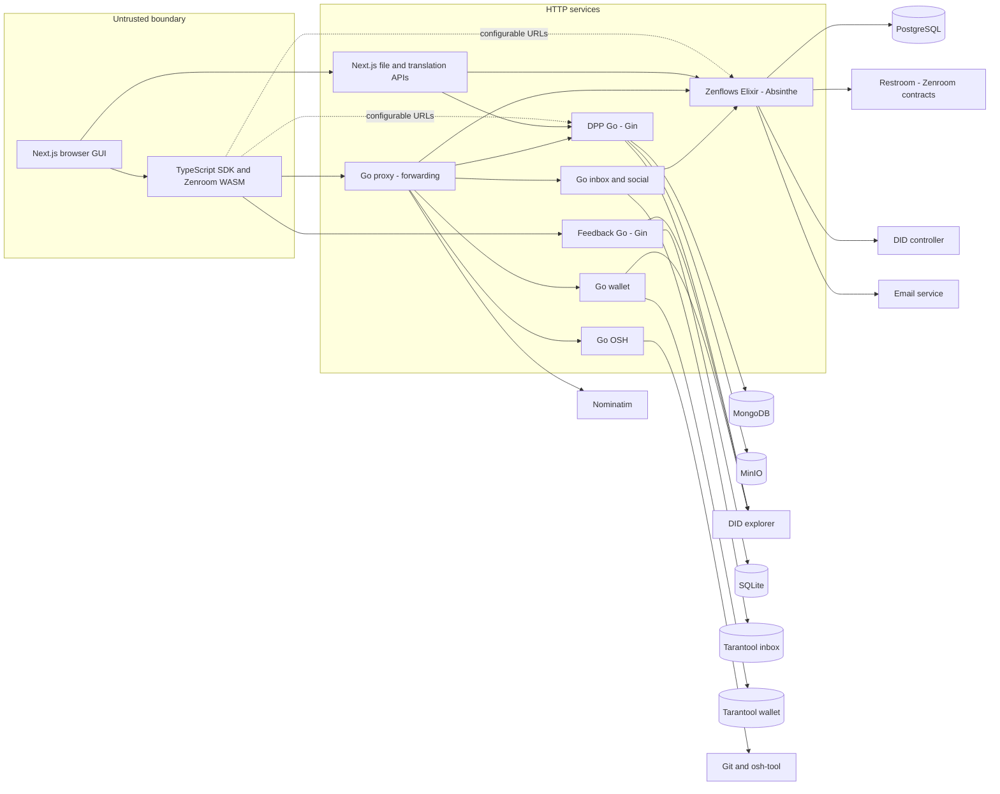

> **English edition.** [Italian version](../it/02-current-architecture.md) · Technical terms and commit-pinned evidence are shared across both editions.

# 02 · Current architecture

## View reconstructed from code

Arrows indicate deployed/configurable calls, not an inventory of containers actually in production.

| Component | Liability and API | Persistence / dependencies | Boundary of trust |
|---|---|---|---|
| interfacer-gui | Next.js/React; Same-origin UI and API for files/translations | localStorage for identities/keys; commerce status in browser | The browser cannot be permission authority |
| interfacer-client | SDK fetch GraphQL/REST, signature, assets, files, inbox/wallet/social | Storage injected; Zenroom | It is not an enforcement server |
| interfacer-proxy | Zenflows, DPP, inbox, wallet, OSH and geocoding prefixes | No DB; URL from env | Forward method/body/header, not authentic |
| zenflows | ValueFlows, People/Orgs, Events, Resources, Processes, Proposals, Files | PostgreSQL via Ecto; Absinthe/Plug; Restroom; DID; email | GraphQL Root Signature; domain without principal in CRUD |
| interfacer-dpp | Passport CRUD, status, attachments, QR | MongoDB `dpp_db`, MinIO; executable `zencode-exec` | DID/signature only in some handlers |
| interfacer-feedback-service | Reviews, comments, summaries | SQLite WAL; publisher in-process log | Middleware writes; incomplete identity binding |
| zenflows-inbox | Messages and social ActivityStreams | Tarantool; lookup public key Zenflows | Signed messages; social has different paths |
| zenflows-wallet | Points/tokens, balance, transactions | Tarantool; DID + Zenroom binding Go | Signing the transaction does not limit who can issue points |
| zenflows-crypto | Zencode Contracts and Execution Image | No permission store | Cryptographic verification, not business policy |
| zenflows-osh | Repository and shortlog analysis | Git temporary clones, `osh` CLI | External input and network/filesystem access |
| zenflows-fabaccess | ON/OFF commands and machine status | Remote Fabaccess, account configured | DID/signature/timestamp before shared account |
| zenflows-bank | CLI export/list/airdrop | Tarantool, file, RPC Ethereum/Fabcoin | Privileged offline commands, not checkout Medusa |

Sources: [interfacer-proxy/main.go:67–143](https://github.com/interfacerproject/interfacer-proxy/blob/10d07344e2bcf7e3673f906e51aeb52cd6abf0cb/main.go#L67-L143); [zenflows/src/zenflows/web/router.ex:26–70](https://github.com/interfacerproject/zenflows/blob/893489d81fddf07e470094e72863958de402cca7/src/zenflows/web/router.ex#L26-L70); [interfacer-dpp/cmd/main/main.go:30–54](https://github.com/interfacerproject/interfacer-dpp/blob/5f6ae20380ae80716ac6a8742b69bdc82e141296/cmd/main/main.go#L30-L54); [interfacer-dpp/internal/database/database.go:19–81](https://github.com/interfacerproject/interfacer-dpp/blob/5f6ae20380ae80716ac6a8742b69bdc82e141296/internal/database/database.go#L19-L81); [interfacer-feedback-service/cmd/main/main.go:41–57](https://github.com/interfacerproject/interfacer-feedback-service/blob/d905a82a02d4115b13c87557591b7ddca6eb39b1/cmd/main/main.go#L41-L57); [interfacer-feedback-service/internal/database/database.go:18–116](https://github.com/interfacerproject/interfacer-feedback-service/blob/d905a82a02d4115b13c87557591b7ddca6eb39b1/internal/database/database.go#L18-L116); [zenflows-inbox/inbox.go:697–725](https://github.com/interfacerproject/zenflows-inbox/blob/963ae1d38116fb17ed35d6524ca7cfb8f16c0efd/inbox.go#L697-L725); [zenflows-wallet/wallet.go:218–224](https://github.com/interfacerproject/zenflows-wallet/blob/f5cf1668afe371329ed827d0bb56557e0bedcda6/wallet.go#L218-L224); [zenflows-fabaccess/main.py:55–123](https://github.com/interfacerproject/zenflows-fabaccess/blob/8294b50a9e97f2ef85ad72fc0bc0cff66af33cfc/main.py#L55-L123); [zenflows-bank/cmd/airdrop.go:31–125](https://github.com/interfacerproject/zenflows-bank/blob/e5c2d2e6bd1ad072d1575de0a2be983854429b35/cmd/airdrop.go#L31-L125).

## Public and internal APIs

- Zenflows exposes `/api`, `/api/file`, `/play` and `/schema`. GraphiQL is another entry to the same schema, not a different permission.
- The proxy registers fixed prefixes: it is not an arbitrary proxy for every URL, but not a security API gateway either. There is no feedback routing in the analyzed commit; the GUI uses configurable `feedbackUrl`.
- DPP listen on `:8080`, feedback on `:8081`. The DPP compose also publishes MongoDB and MinIO and configures anonymous bucket download. **These are properties of the compose file, not evidence of Internet exposure.**
- Restroom receives body and public keys from the server for verification, shard/salt for Keypairoom, and possibly keyring for DID signature. It should be treated as part of the crypto perimeter, not a harmless service accessible to all.
- A universal service identity or delegation protocol is not present in the examined code. Inbox and bank contain credentials/configurations to make requests on behalf of an agent; DPP resolves the DID but does not ask Zenflows for permissions.

Evidence: [interfacer-proxy/main.go:160–241](https://github.com/interfacerproject/interfacer-proxy/blob/10d07344e2bcf7e3673f906e51aeb52cd6abf0cb/main.go#L160-L241); [interfacer-gui/contexts/AuthContext.tsx:81–109](https://github.com/interfacerproject/interfacer-gui/blob/9afe601d4d28dd6ccc0b4db2092da65f8055823e/contexts/AuthContext.tsx#L81-L109); [interfacer-dpp/docker-compose.yml:3–61](https://github.com/interfacerproject/interfacer-dpp/blob/5f6ae20380ae80716ac6a8742b69bdc82e141296/docker-compose.yml#L3-L61); [zenflows/src/zenflows/restroom.ex:47–133](https://github.com/interfacerproject/zenflows/blob/893489d81fddf07e470094e72863958de402cca7/src/zenflows/restroom.ex#L47-L133); [zenflows/src/zenflows/did.ex:63–112](https://github.com/interfacerproject/zenflows/blob/893489d81fddf07e470094e72863958de402cca7/src/zenflows/did.ex#L63-L112).

## Deployment and versions

Zenflows offers server + PostgreSQL + `zenflows-crypto` image; `latest` images do not capture the actually executed code. The Dockerfile uses Elixir releases and non-root user. DPP proposes MongoDB/MinIO/app with bootstrap bucket; do not assume that the compose is the public platform deployment. GUI has standalone Next builds and pre-existing publishing workflows; they have not been changed.

[zenflows/devop/.docker-compose.templ:1–43](https://github.com/interfacerproject/zenflows/blob/893489d81fddf07e470094e72863958de402cca7/devop/.docker-compose.templ#L1-L43); [interfacer-dpp/docker-compose.yml:3–61](https://github.com/interfacerproject/interfacer-dpp/blob/5f6ae20380ae80716ac6a8742b69bdc82e141296/docker-compose.yml#L3-L61). [Commit, submodule and deployment to verify](appendix/repository-map.md).

## Actual project template

The GUI calls a composition of `EconomicResource`, `ResourceSpecification`, `Process` and events a “project”. The SDK first creates process/location, then an event that produces the resource. `Proposal` and `Intent` also exist, but they are not an ACL table or a seller entity.

[interfacer-client/src/resources/ResourceClient.ts:141–245](https://github.com/interfacerproject/interfacer-client/blob/dfb1baabf16516a845957d5587ccb933c1874221/src/resources/ResourceClient.ts#L141-L245). Contributing relationships pass through events and metadata/notifications: [interfacer-gui/hooks/useProjectCRUD.ts:67–119](https://github.com/interfacerproject/interfacer-gui/blob/9afe601d4d28dd6ccc0b4db2092da65f8055823e/hooks/useProjectCRUD.ts#L67-L119). These multiple calls do not constitute a distributed transaction.

## Trust boundary not to be missed

1. Browser → any service URL: All input IDs are declarations.
2. Gateway → backend: forwarding a header does not make it trustworthy.
3. Resolver → domain → DB: A GraphQL-only check does not cover import and job.
4. Zenflows → DPP: semantic links, without cross-database FK or current authorization decision.
5. Application → DID/Restroom/Fabaccess/Git: external dependencies with their own privileges and availability.
6. Public response → relations/files/cache: The policy must cover the entire returned graph, not just the root object.
