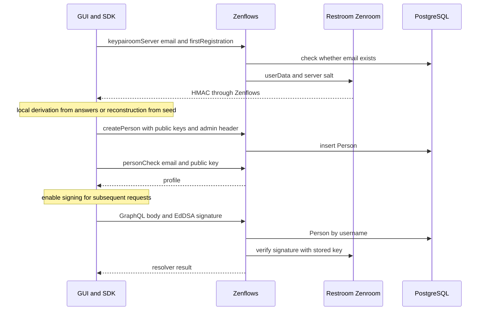

> **English edition.** [Italian version](../it/03-authentication-analysis.md) · Technical terms and commit-pinned evidence are shared across both editions.

# 03 · Authentication

## Registration, login and recovery

1. `requestHmac` calls `keypairoomServer`, guest. The backend checks the existence of the email based on `firstRegistration`; does not demonstrate possession of the square in this passage. [zenflows/src/zenflows/keypairoom/domain.ex:30–40](https://github.com/interfacerproject/zenflows/blob/893489d81fddf07e470094e72863958de402cca7/src/zenflows/keypairoom/domain.ex#L30-L40); [interfacer-client/src/auth/AuthClient.ts:51–241](https://github.com/interfacerproject/interfacer-client/blob/dfb1baabf16516a845957d5587ccb933c1874221/src/auth/AuthClient.ts#L51-L241).
2. The browser derives keys from five personal responses and HMAC shards or reconstructs them from seeds and HMAC. The SDK persists EdDSA, Ethereum, Reflow, Bitcoin, ECDH and seed. [interfacer-client/src/crypto/keypair.ts:47–144](https://github.com/interfacerproject/interfacer-client/blob/dfb1baabf16516a845957d5587ccb933c1874221/src/crypto/keypair.ts#L47-L144).
3. `createPerson` is **admin-only** in the scheme, not a normal signed mutation; the SDK can send `zenflows-admin`. The GUI configures the client in the browser. The lifecycle of this credential requires priority intervention, with operational details in the confidential report. [zenflows/src/zenflows/vf/person/type.ex:179–270](https://github.com/interfacerproject/zenflows/blob/893489d81fddf07e470094e72863958de402cca7/src/zenflows/vf/person/type.ex#L179-L270); [interfacer-client/src/auth/AuthClient.ts:51–241](https://github.com/interfacerproject/interfacer-client/blob/dfb1baabf16516a845957d5587ccb933c1874221/src/auth/AuthClient.ts#L51-L241); [interfacer-gui/contexts/AuthContext.tsx:81–109](https://github.com/interfacerproject/interfacer-gui/blob/9afe601d4d28dd6ccc0b4db2092da65f8055823e/contexts/AuthContext.tsx#L81-L109).
4. Login use `personCheck(email, eddsaPublicKey)`, guest, to retrieve the profile. It is not a private ownership challenge and does not generate a server session. Proof of ownership occurs in subsequent signed requests, not in the GUI boolean `authenticated`. [zenflows/src/zenflows/vf/person/resolv.ex:38–85](https://github.com/interfacerproject/zenflows/blob/893489d81fddf07e470094e72863958de402cca7/src/zenflows/vf/person/resolv.ex#L38-L85).
5. Restore from localStorage and logout are local operations; `logout()` clears storage and disables signing, **does not revoke an already copied key**. [interfacer-gui/contexts/AuthContext.tsx:242–302](https://github.com/interfacerproject/interfacer-gui/blob/9afe601d4d28dd6ccc0b4db2092da65f8055823e/contexts/AuthContext.tsx#L242-L302); [interfacer-client/src/auth/AuthClient.ts:51–241](https://github.com/interfacerproject/interfacer-client/blob/dfb1baabf16516a845957d5587ccb933c1874221/src/auth/AuthClient.ts#L51-L241).

## Signing and identification in Zenflows

The SDK serializes query/variables/operationName, signs and sends `zenflows-user`, `zenflows-sign`, `zenflows-hash`. The server uses raw body, username and signature; the middleware searches for the Person by username and checks with its EdDSA public key. Only then does it write `req_user` in context.

[interfacer-client/src/graphql/GraphQLClient.ts:27–84](https://github.com/interfacerproject/interfacer-client/blob/dfb1baabf16516a845957d5587ccb933c1874221/src/graphql/GraphQLClient.ts#L27-L84); [interfacer-client/src/crypto/sign.ts:36–137](https://github.com/interfacerproject/interfacer-client/blob/dfb1baabf16516a845957d5587ccb933c1874221/src/crypto/sign.ts#L36-L137); [zenflows/src/zenflows/web/mw/gql_context.ex:34–68](https://github.com/interfacerproject/zenflows/blob/893489d81fddf07e470094e72863958de402cca7/src/zenflows/web/mw/gql_context.ex#L34-L68); [zenflows/src/zenflows/gql/mw/sign.ex:28–72](https://github.com/interfacerproject/zenflows/blob/893489d81fddf07e470094e72863958de402cca7/src/zenflows/gql/mw/sign.ex#L28-L72).

The contract performs space/string normalization before verification; so do not describe the mechanism as strictly signing each HTTP byte. It does not include method, path, audience, nonce, or deadline. The hash sent by the SDK is not used by the Sign middleware as a standalone check. [zenflows-crypto/src/verify_graphql.zen:17–44](https://github.com/interfacerproject/zenflows-crypto/blob/0ffcce9b90799c9cb61f11fc594aeb513a01326f/src/verify_graphql.zen#L17-L44).

**Risk to check:** semantics of normalization on string values; you need test vectors with significant whitespace. **Confirmed limitation:** no freshness checks in the examined GraphQL paths; a reused signature may remain valid, but the effects depend on the mutation and DB constraints.

`GQL_AUTH_CALLS` is true by default; if set to false, Sign and Admin do not verify credentials. Live configuration has not been verified. A present admin header prevents the middleware context from reading user headers: the admin is not automatically a universal superuser for all signed mutations. [zenflows/conf/runtime.exs:89–131](https://github.com/interfacerproject/zenflows/blob/893489d81fddf07e470094e72863958de402cca7/conf/runtime.exs#L89-L131); [zenflows/src/zenflows/gql/mw/admin.ex:28–42](https://github.com/interfacerproject/zenflows/blob/893489d81fddf07e470094e72863958de402cca7/src/zenflows/gql/mw/admin.ex#L28-L42); [zenflows/src/zenflows/web/mw/gql_context.ex:34–68](https://github.com/interfacerproject/zenflows/blob/893489d81fddf07e470094e72863958de402cca7/src/zenflows/web/mw/gql_context.ex#L34-L68).

## Keys, recovery and revocation

| Appearance | Observed implementation | Consequence / work needed |
|---|---|---|
| Storage browser | localStorage adapter and explicit seed/key copies | Any same-origin malicious JavaScript can read them; no evidence of XSS exploited |
| Rotation Person | Keys present in create; update GraphQL does not expose them and changeset update does not include them | Design authenticated rotation and retrieval, not ordinary manual edits |
| Revoke Account | `deletePerson` admin; no logs of revoked sessions/keys in the analyzed paths | FK can hinder delete; explicit disabling preferable |
| Verify email | Resolver uses `req_user`, then HMAC token in the email domain | Positive example of binding to the actor; email verification is not universal requirement Sign |
| DID claim | `claimPerson(id)` signed, resolver uses input ID; server signature request with own keyring | Limit to self or explicit delegation; evaluate controller and DID revocation separately |
| Technical Credentials | Env/static configuration for admin, DID signing, DB, storage, Fabaccess | Distinct identities, minimum scopes, rotation and consumer inventory |

[interfacer-client/src/config/storage.ts:1–40](https://github.com/interfacerproject/interfacer-client/blob/dfb1baabf16516a845957d5587ccb933c1874221/src/config/storage.ts#L1-L40); [zenflows/src/zenflows/vf/person.ex:44–111](https://github.com/interfacerproject/zenflows/blob/893489d81fddf07e470094e72863958de402cca7/src/zenflows/vf/person.ex#L44-L111); [zenflows/src/zenflows/vf/person/type.ex:179–270](https://github.com/interfacerproject/zenflows/blob/893489d81fddf07e470094e72863958de402cca7/src/zenflows/vf/person/type.ex#L179-L270); [zenflows/src/zenflows/vf/person/resolv.ex:38–85](https://github.com/interfacerproject/zenflows/blob/893489d81fddf07e470094e72863958de402cca7/src/zenflows/vf/person/resolv.ex#L38-L85); [zenflows/src/zenflows/did.ex:63–112](https://github.com/interfacerproject/zenflows/blob/893489d81fddf07e470094e72863958de402cca7/src/zenflows/did.ex#L63-L112).

### Email expiration: Important exception

The token→person binding and HMAC are present, but the temporal comparison uses `issued_at < now + expiry`: does not reject old tokens. [F11, local evidence and verification](04-authorization-audit.md#f11-inverted-email-expiration-predicate-confirmed-p1). Fix the predicate and add expiration tests without eliminating self/HMAC checks.

Personal responses used for derivation may have limited entropy: this is a design risk to be measured by maintainers and the Keypairoom protocol, not a demonstration of key recovery. Don't think of them as high-entropy random secrets.

## Organizations and other services

Sign identifies a **Person**, not an organization selected in the GUI. Organization and AgentRelationship exist, but not an authenticated context `acting_for` with verified membership in the examined paths. Putting an organization ID in provider/receiver does not prove delegation.

DPP and wallet accept declared key and verify signature + DID resolution with HTTP 200 response; they do not automatically load the Zenflows Person. Feedback adds a separate user ID. Inbox is a useful contrast: it retrieves the key of the sender/receiver indicated in the body and verifies that signature. [interfacer-dpp/internal/auth/auth.go:98–151](https://github.com/interfacerproject/interfacer-dpp/blob/5f6ae20380ae80716ac6a8742b69bdc82e141296/internal/auth/auth.go#L98-L151); [zenflows-wallet/did-auth.go:43–78](https://github.com/interfacerproject/zenflows-wallet/blob/f5cf1668afe371329ed827d0bb56557e0bedcda6/did-auth.go#L43-L78); [interfacer-feedback-service/internal/auth/middleware.go:15–88](https://github.com/interfacerproject/interfacer-feedback-service/blob/d905a82a02d4115b13c87557591b7ddca6eb39b1/internal/auth/middleware.go#L15-L88); [zenflows-inbox/zenflows-auth.go:11–36](https://github.com/interfacerproject/zenflows-inbox/blob/963ae1d38116fb17ed35d6524ca7cfb8f16c0efd/zenflows-auth.go#L11-L36); [zenflows-inbox/inbox.go:80–243](https://github.com/interfacerproject/zenflows-inbox/blob/963ae1d38116fb17ed35d6524ca7cfb8f16c0efd/inbox.go#L80-L243).

## Incremental proposal

Keep EdDSA for initial compatibility, but centralize binding **verified key → stable subject**, with active accounts/keys. For new operations use envelope versioned with method/path/body digest, audience, request ID and time, and replay cache server. Don't introduce JWT just to change format: you need issuer, verification, audience, revocation and purposes. For browsers, evaluate a future HttpOnly BFF session after challenge, without migrating all key management at the same time. [Proposed architecture](09-proposed-architecture.md).
