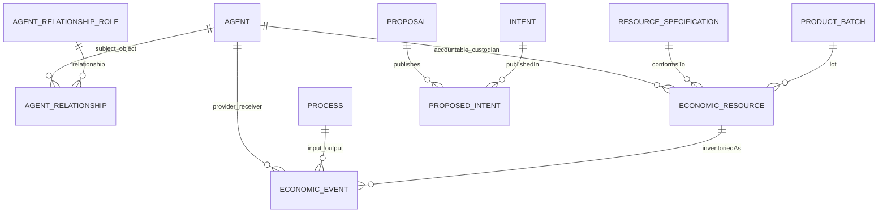

> **English edition.** [Italian version](../it/05-zenflows-analysis.md) · Technical terms and commit-pinned evidence are shared across both editions.

# 05 · Zenflows and ValueFlows

## Current model and semantics

Semantic diagram, not full DDL. Person and Organization are views/schemas of the Agent world, not separate users/tenants with native ACLs. [zenflows/src/zenflows/vf/person.ex:44–111](https://github.com/interfacerproject/zenflows/blob/893489d81fddf07e470094e72863958de402cca7/src/zenflows/vf/person.ex#L44-L111); [zenflows/src/zenflows/vf/agent_relationship.ex:34–64](https://github.com/interfacerproject/zenflows/blob/893489d81fddf07e470094e72863958de402cca7/src/zenflows/vf/agent_relationship.ex#L34-L64); [zenflows/src/zenflows/vf/economic_resource.ex:83–157](https://github.com/interfacerproject/zenflows/blob/893489d81fddf07e470094e72863958de402cca7/src/zenflows/vf/economic_resource.ex#L83-L157). [Data Details](appendix/data-model.md).

| Concept | Observed | Reuse allowed for permits |
|---|---|---|
| Agent / Person | Person identity and public keys; Sign seeks Person | Person ID as stable subject, with account status and keys added |
| Organization | Cheap agent with ordinary CRUD | ID as scope; implicit non-membership |
| AgentRelationship | subject/object/relationship; `in_scope_of` commented | Descriptive link; administrative membership only after workflow and protection |
| EconomicResource | Responsibility, custody, specification, quantity, metadata, previousEvent | object ID; do not derive grants from arbitrary metadata |
| EconomicEvent | provider/receiver, action, process, resources, quantity; side effect | Source of provenance and effects to be authorized, not delegation |
| Process / ProcessGroup | Organization of activities, grouping with invariants | Possible association with explicit project scope |
| Proposal / Intent | Economic proposals and intentions, links publishes | Non-seller account, non-invitation accepted or ACL |
| primaryAccountable | Economic responsibility, initialized by receiver in production | Business attribute and possible clue for migration, not administrative title |
| custodian | Physical/onhand case | Logistics permits only via dedicated grant, not edit specifications |

## Creating a resource: full path

GUI `useProjectCRUD` → SDK `createProject` → create Process/location → `createEconomicEvent` with `produce` and new resource → MW.Sign → resolver ignore context → `Domain.create` → Ecto.Multi → changeset event → `handle_insert` → `EconomicResource.Domain.multi_insert` → PostgreSQL.

The SDK chooses agents from user storage; the server cannot assume that another client will do the same. Creation assigns primaryAccountable and custodian to the event receiver; does not automatically register a verified administrator.

[interfacer-client/src/resources/ResourceClient.ts:141–245](https://github.com/interfacerproject/interfacer-client/blob/dfb1baabf16516a845957d5587ccb933c1874221/src/resources/ResourceClient.ts#L141-L245); [zenflows/src/zenflows/vf/economic_event/resolv.ex:38–49](https://github.com/interfacerproject/zenflows/blob/893489d81fddf07e470094e72863958de402cca7/src/zenflows/vf/economic_event/resolv.ex#L38-L49); [zenflows/src/zenflows/vf/economic_event/domain.ex:124–285](https://github.com/interfacerproject/zenflows/blob/893489d81fddf07e470094e72863958de402cca7/src/zenflows/vf/economic_event/domain.ex#L124-L285).

## Update and indirect paths

- Direct update: GraphQL limits the fields, but not the actor. `Domain.update` uses a larger changeset than the GraphQL input. This is important for job/import and future APIs.
- Metadata update via SDK: create a process and record `accept`/`modify` events according to the client's GraphQL operations; authorize the sequence and not just the direct setter.
- Transfers: `transferAllRights` concerns accounting/primaryAccountable; `transferCustody` concerns onhand/custodian; `transfer` combines effects. Quantities and destinations produce updates or new resources, even on contents of a container.
- `cite`/`use`: modify lineage/previousEvent even if they do not transfer ownership. A permission to cite publicly must not become permission to alter the cited resource without approved semantics.
- Organization/AgentRelationship CRUD can change the basis of a future ReBAC. Do not turn on inheritance before protecting the writing of reports.
- File: associations recreated during updates; association deletion and cleanup must inherit the object's policy, not be a shortcut.

[zenflows/src/zenflows/vf/economic_resource/type.ex:224–353](https://github.com/interfacerproject/zenflows/blob/893489d81fddf07e470094e72863958de402cca7/src/zenflows/vf/economic_resource/type.ex#L224-L353); [zenflows/src/zenflows/vf/economic_resource/domain.ex:246–332](https://github.com/interfacerproject/zenflows/blob/893489d81fddf07e470094e72863958de402cca7/src/zenflows/vf/economic_resource/domain.ex#L246-L332); [interfacer-client/src/resources/ResourceClient.ts:285–350](https://github.com/interfacerproject/interfacer-client/blob/dfb1baabf16516a845957d5587ccb933c1874221/src/resources/ResourceClient.ts#L285-L350); [zenflows/src/zenflows/vf/economic_event/domain.ex:782–909](https://github.com/interfacerproject/zenflows/blob/893489d81fddf07e470094e72863958de402cca7/src/zenflows/vf/economic_event/domain.ex#L782-L909); [zenflows/src/zenflows/vf/agent_relationship/resolv.ex:36–51](https://github.com/interfacerproject/zenflows/blob/893489d81fddf07e470094e72863958de402cca7/src/zenflows/vf/agent_relationship/resolv.ex#L36-L51); [zenflows/src/zenflows/file/domain.ex:67–123](https://github.com/interfacerproject/zenflows/blob/893489d81fddf07e470094e72863958de402cca7/src/zenflows/file/domain.ex#L67-L123).

## What is missing for collaboration and organizations

In the models examined, administrative membership with invitation/acceptance/revocation, administrative owner immutable compared to normal edits, delegate with purposes/expiry, resource-scoped ACL, verified commercial seller are not represented. Contributors in the frontend are metadata/events/notifications; `addContributor` in the GUI commit calls an SDK method that uses the current user, while the recipient of the notification is a separate parameter: it is not reliable proof of contributor consent.

[interfacer-gui/hooks/useProjectCRUD.ts:67–119](https://github.com/interfacerproject/interfacer-gui/blob/9afe601d4d28dd6ccc0b4db2092da65f8055823e/hooks/useProjectCRUD.ts#L67-L119); [interfacer-client/src/resources/ResourceClient.ts:285–350](https://github.com/interfacerproject/interfacer-client/blob/dfb1baabf16516a845957d5587ccb933c1874221/src/resources/ResourceClient.ts#L285-L350). The pre-existing override of this hook has not been overwritten and is not used as a commit-pinned test.

## Migration of responsibilities

Do not rename `primaryAccountable` to `owner`. Maintain economic history and add `administrative_controller` as a separate authorization relationship. For new assets: Verified creator gets personal admin only if they create for themselves; if created by organization, control belongs to the organization after delegation verification. For historical resources: candidates and evidence, explicit decision, audit. The import that uses the first email makes an automatic backfill particularly dangerous. [zenflows/src/zenflows/sw_pass/domain.ex:108–197](https://github.com/interfacerproject/zenflows/blob/893489d81fddf07e470094e72863958de402cca7/src/zenflows/sw_pass/domain.ex#L108-L197).

## Proposed enforcement point

Application service/domain entrypoint receives `ExecutionContext(subject, service, acting_for, request_id)`; loads objects and memberships, authorizes transactions, validates invariants, persists and records audits. `multi_*` and raw calls should not remain a context-free public alternative. It is not necessary to introduce RLS in the first step, but the applications' DB permissions must not include access to the DBs of other services.
