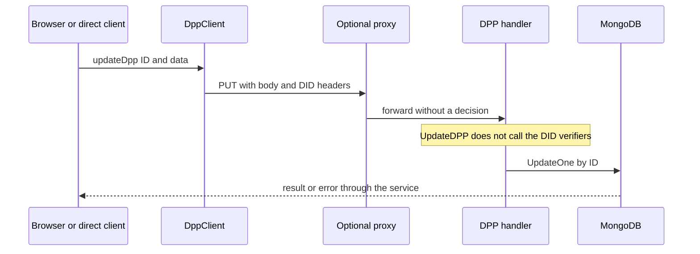

> **English edition.** [Italian version](../it/06-dpp-analysis.md) · Technical terms and commit-pinned evidence are shared across both editions.

# 06 · Digital Product Passport

## Loop implemented

| Operation | Real Behavior | Current control |
|---|---|---|
| Creation | JSON→struct, new ULID, date server, default draft | DID HTTP 200 + signature body; no verification productId/organization |
| Single/list reading | MongoDB for IDs or optional filters, search/facet | No visibility/status policy |
| Update | Bind struct and `$set`; includes system fields | No auth in handler; possible error `_id` immutable |
| Cancellation | DeleteOne for ID | No auth in handler; not a distributed deletion of all copies |
| Publication/archive | `draft→active/archived`, `active→archived`, `archived→draft` | Transition validation, not allowed to publish |
| Generic upload | SHA-256 hash, signature, MinIO, URL and metadata | DID/signature; no parent objects allowed |
| Add attachment | Upload and push to `attachments.<section>` | DID/signature checksum, not policy DPP/section |
| Delete attachment | Removing from Mongo and MinIO best effort | No auth in handler |
| QR | Constructed public URL PNG with valid ID | It does not prove existence, ownership or authenticity of the content |

Sources: [interfacer-dpp/cmd/main/main.go:30–54](https://github.com/interfacerproject/interfacer-dpp/blob/5f6ae20380ae80716ac6a8742b69bdc82e141296/cmd/main/main.go#L30-L54); [interfacer-dpp/internal/handler/handler.go:41–116](https://github.com/interfacerproject/interfacer-dpp/blob/5f6ae20380ae80716ac6a8742b69bdc82e141296/internal/handler/handler.go#L41-L116); [interfacer-dpp/internal/handler/handler.go:154–224](https://github.com/interfacerproject/interfacer-dpp/blob/5f6ae20380ae80716ac6a8742b69bdc82e141296/internal/handler/handler.go#L154-L224); [interfacer-dpp/internal/handler/handler.go:480–551](https://github.com/interfacerproject/interfacer-dpp/blob/5f6ae20380ae80716ac6a8742b69bdc82e141296/internal/handler/handler.go#L480-L551); [interfacer-dpp/internal/handler/handler.go:348–478](https://github.com/interfacerproject/interfacer-dpp/blob/5f6ae20380ae80716ac6a8742b69bdc82e141296/internal/handler/handler.go#L348-L478); [interfacer-dpp/internal/handler/handler.go:553–674](https://github.com/interfacerproject/interfacer-dpp/blob/5f6ae20380ae80716ac6a8742b69bdc82e141296/internal/handler/handler.go#L553-L674); [interfacer-dpp/internal/handler/handler.go:676–753](https://github.com/interfacerproject/interfacer-dpp/blob/5f6ae20380ae80716ac6a8742b69bdc82e141296/internal/handler/handler.go#L676-L753).

## Connections with Zenflows

Two forms coexist in the code:

1. The standalone DPP form selects products with GUI filter `primaryAccountable = user.ulid`, then sends `productId`, `batchType` (`batch` or `unit`) and `batchId`. The filter is UX, not backend control. [interfacer-gui/components/partials/create/dpp/CreateDppForm.tsx:124–231](https://github.com/interfacerproject/interfacer-gui/blob/9afe601d4d28dd6ccc0b4db2092da65f8055823e/components/partials/create/dpp/CreateDppForm.tsx#L124-L231).
2. The SDK can create a DPP specification EconomicResource with `dppServiceUlid` metadata. [interfacer-client/src/resources/ResourceClient.ts:141–245](https://github.com/interfacerproject/interfacer-client/blob/dfb1baabf16516a845957d5587ccb933c1874221/src/resources/ResourceClient.ts#L141-L245).

In the DPP service `ProductID` is a string without Zenflows lookup. `EconomicOperator` contains company descriptive data (name, GLN/EORI, address), not a verified Membership Organization. `createdBy` can be ULID or public key. The unique productId+batchId partial index tries to avoid duplicates, but index creation errors are only logged: check actual MongoDB installation and version compatibility.

[interfacer-dpp/internal/model/model.go:25–51](https://github.com/interfacerproject/interfacer-dpp/blob/5f6ae20380ae80716ac6a8742b69bdc82e141296/internal/model/model.go#L25-L51); [interfacer-dpp/internal/model/model.go:127–147](https://github.com/interfacerproject/interfacer-dpp/blob/5f6ae20380ae80716ac6a8742b69bdc82e141296/internal/model/model.go#L127-L147); [interfacer-dpp/internal/database/database.go:19–81](https://github.com/interfacerproject/interfacer-dpp/blob/5f6ae20380ae80716ac6a8742b69bdc82e141296/internal/database/database.go#L19-L81).

## A DPP edit today

[interfacer-client/src/dpp/DppClient.ts:27–149](https://github.com/interfacerproject/interfacer-client/blob/dfb1baabf16516a845957d5587ccb933c1874221/src/dpp/DppClient.ts#L27-L149); [interfacer-proxy/main.go:160–241](https://github.com/interfacerproject/interfacer-proxy/blob/10d07344e2bcf7e3673f906e51aeb52cd6abf0cb/main.go#L160-L241); [interfacer-dpp/internal/handler/handler.go:154–224](https://github.com/interfacerproject/interfacer-dpp/blob/5f6ae20380ae80716ac6a8742b69bdc82e141296/internal/handler/handler.go#L154-L224). The presence of signed headers in the SDK does **not prove** that the backend controls them; the SDK comment «all endpoints authenticated» does not match the implementation. Furthermore, bodyless calls produce no signature in `signedRequest`.

## Sufficient model? Not yet

The document contains typed sections, product/batch, and repair fields. It does not represent a repair ledger with verified actor/version/signature per event, nor design/model/batch/instance/listing as distinct and constrained entities. `RepairInformation` is a single descriptive structure, not an append-only sequence.

**Proposal**, to be validated with DPP domain:

| Logical entity | Identity / relationship | Policy |
|---|---|---|
| Design | EconomicResource project and version | Technical collaboration |
| Product model | Resource ID and specification revision | Authorized Manufacturer |
| Lot | Batch ID scoped to model and manufacturer | Quality/manufacturing |
| Exemplary | Stable and serial ID, possible batch | Custody, repairs, condition; personal property reserved |
| Listing | Medusa ID, seller and variant | Sale; not the same as template or DPP |
| Passport | DPP ID, typed subject, immutable/versioned parent resource | Basic permissions from the resource, policy sections in the DPP |

Avoid duplicating all ValueFlows in MongoDB: add authoritative binding and versions, not a second independent economic graph. Each change of parent or producer is a privileged command with control over source/destination, not a field of a generic PUT.

## Policy sections proposal

| Section / action | Actors admitted, with equal scope | Limits |
|---|---|---|
| Product specifications, manufacturer identity | Manufacturer editor; publisher for release | Immutable published version, correction as revision |
| Environment/materials | Sustainability delegate editor | Evidence and approval for public claims |
| Certifications | Explicit Certifier/quality reviewer | Issuer attribution and verifiable attachment, not implicit self-declaration |
| Repairs/maintenance | Repair operator for authorized instance | Append only; does not modify original specifications |
| Properties/contacts | Controller/privacy role and interested party according to purpose | No buyer address in public showing |
| Attachments | Same scope as section plus attach/remove | permission Private storage, MIME verified, separate download source |
| Publication/withdrawal | DPP publisher | Completeness checks, audits, retention |
| Delete draft | Delegated Controller | No indiscriminate hard-delete of published passports |

For each ordinary edit, request both the right to the resource and the specific DPP right. Append repair is a **different permission**, not a way to get around the resource's edit ban. A repair grant does not give `resource.update`, `dpp.spec.update` or `dpp.publish`.

## Concurrency, consistency and attachments

`UpdateDPPStatus` reads state and updates by ID, without including the read state in the predicate: a future implementation should use compare-and-swap (`version`, expected state) and allow the actual transition. A generic PUT today does not apply the same transitions: unify them in the domain.

AddAttachment first loads to storage then updates Mongo; mistakes can leave you orphaned. DeleteAttachment removes best effort storage. Use staging/quarantine, reference commit, idempotent cleanup. Never use the checksum alone as a capability: the digest demonstrates content, not recipient, access or author.

The addAttachment SDK signs checksums via `signDidRequest` (text base64), while server passes raw checksums to the base64 contract; generic upload has a separate helper. **Potential incompatibility to be tested**, no operation or cryptographic bypass is assumed. [interfacer-client/src/crypto/sign.ts:36–137](https://github.com/interfacerproject/interfacer-client/blob/dfb1baabf16516a845957d5587ccb933c1874221/src/crypto/sign.ts#L36-L137); [interfacer-client/src/dpp/DppClient.ts:27–149](https://github.com/interfacerproject/interfacer-client/blob/dfb1baabf16516a845957d5587ccb933c1874221/src/dpp/DppClient.ts#L27-L149); [interfacer-dpp/internal/handler/handler.go:553–674](https://github.com/interfacerproject/interfacer-dpp/blob/5f6ae20380ae80716ac6a8742b69bdc82e141296/internal/handler/handler.go#L553-L674).
