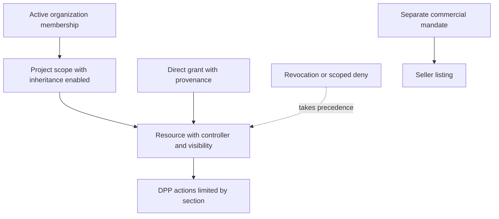

> **English edition.** [Italian version](../it/08-permission-model.md) · Technical terms and commit-pinned evidence are shared across both editions.

# 08 · Proposed permissions model

**Status: Proposed.** The following entities and names are not existing tables/APIs.

## Choice: RBAC scoped + explicit relationships + attributes

- **RBAC:** understandable roles (org admin, project manager, editor, viewer, seller operator, repair operator) as versioned sets of actions.
- **ReBAC limited:** membership and grants on organization/project/resource; controlled inheritance. Don't automatically convert every AgentRelationship into a delegation.
- **ABAC:** account status, invitation accepted, expiration, public/private classification, DPP status/version, section, acting_for context.
- **Capability:** useful for temporary downloads and limited jobs, not for turning each ID/URL into a permanent bearer token.

Global RBAC does not distinguish projects; Pure ABAC risks opaque policies; General-purpose ReBAC is premature without relationship rules. The simple hybrid model covers current demand.

## New logical entities

| Proposed entity | Minimum data | Authority |
|---|---|---|
| Principal | Person or service ID, status, active keys/versions | Zenflows identity module |
| OrganizationMembership | subject, org, roles, invited/active/revoked status, validity | Zenflows permission module |
| ProjectScope | ID scope, optional org, associated resources, inheritance flag | Zenflows |
| ResourceControl | resource ID, Person/org controller, visibility, epoch, disputed status | Zenflows |
| Grant | subject/group, scope, actions or role, issuer, expiry, provenance | Zenflows |
| Delegation | subject, acting_for, actions, scope and deadline | Zenflows |
| Invitation | verified recipient, scope, proposed roles, nonce hash, expiry | Zenflows |
| ExternalBinding | service namespace, external ID, resource ID, version, status | Zenflows for authority; controlled DPP copy |
| AuditEvent | actor, service, acting_for, action, object, outcome, policy version, request ID | Append-only audit separated from log requests |

No ACLs inside `metadata`, `createdBy` or `EconomicOperator` strings - they are editable or untested today. [Current model evidence](05-zenflows-analysis.md).

## Proposal matrix

✓ = allowed in scope; G = dedicated grant only; — = denied by default. Roles are not global. An action must also respect applicable account status, scope, attributes, and deny.

| Action | Anonymous | Viewers | Editor | Project manager | Resource controllers | Org admin | Seller operator | Repair operator |
|---|---|---|---|---|---|---|---|---|
| Read public screening | ✓ | ✓ | ✓ | ✓ | ✓ | ✓ | ✓ | ✓ |
| Read private content | — | ✓ | ✓ | ✓ | ✓ | G | G | G |
| Create personal resource | — | G | G | G | G | G | G | G |
| Create by organization | — | — | G | ✓ | G | ✓ | G | — |
| Edit resource contents | — | — | ✓ | ✓ | ✓ | G | G | — |
| Delete/archive resource | — | — | — | G | ✓ | G | — | — |
| Manage grants on the project | — | — | — | ✓ | G | G | — | — |
| Delegate resource administration | — | — | — | G | ✓ | G | — | — |
| Transfer controller | — | — | — | — | G | G | — | — |
| Manage org membership | — | — | — | — | — | ✓ | — | — |
| Inventory/Transfer Events | — | — | G | G | G | G | G | — |
| DPP specifications edit | — | — | G | G | G | G | — | — |
| DPP publish/withdraw | — | — | — | G | G | G | G | — |
| DPP repair append | — | — | — | — | G | G | — | ✓ |
| Commercial listing edit/sell | — | — | — | — | G | G | ✓ | — |
| Commercial Stock | — | — | — | — | G | G | G | — |
| Orders of the assigned seller | — | — | — | — | — | G | ✓ | — |
| Refund/payout | — | — | — | — | — | G | G | — |

Every active person can receive the `resource.create:self` baseline platform; it does not come from the viewer role. Platform operator manages catalogues/configuration and incident response, it does not automatically have universal commercial reading. Break-glass access limited in time, motivated and audited; separation between support and economic administration.

## Inheritance and revocation

Initial proposal: inheritance only from **an** administrative organization/project, never from citations, BOM or ValueFlows containment. Personal resource cited by corporate project does not become corporate. Private Child does not become public because the parent is public. Flag `inherit=false` requires administrative privilege, not normal editor.

Precedence: account/service disabled or deny scoped → deny; revoked membership invalidates derivative grants; Valid direct grant can only survive if independent and approved by the current controller. For org offboarding, default also suspend proxies issued in that capacity and verify grants directed to former members. UI must show **all sources of law**: revoking one grant does not magically cancel another.

Do not automatically inherit sales, refunds, controller transfer, certified publishing, or machine operations. Deny initially limited to account/scope blocking and suspension, avoiding an arbitrary DSL that is difficult to explain.

## Ownership and delegation

The verified creator gets personal control over creation only in the self case. Creation for org requires `resource.create` and verified delegation; the controller is org, not the employee. Controller transfer is a two-step command with recipient consent, privilege verification, existing grant management, and audit. Do not automatically infer this from `transferAllRights`: economic ownership, custody and administrative control may change separately.

No one may grant rights outside their scope or beyond their ability to delegate. An invite does not activate access before acceptance with verified identity. Expiries and revocations are evaluated server-side, not just by deleting a button.

## Public/private and queries

Separate internal record and public projection. Lists, counts, facets, traceDpp, and nested relations must filter before serializing; even a count can disclose presence. `can(action, object)` for the GUI is a versioned hint, not a persistent token. Use consistent errors to not enumerate private objects.
