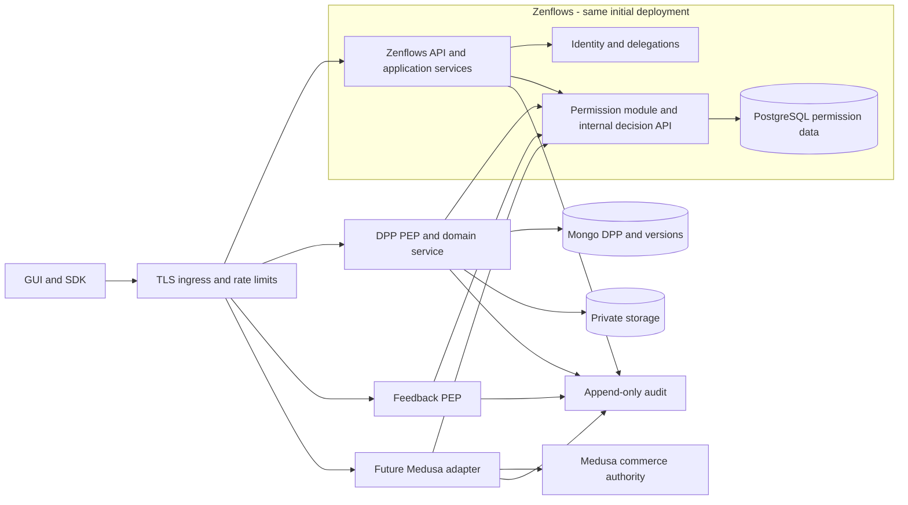
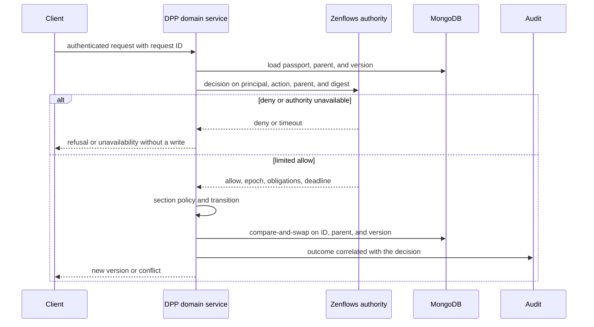

> **English edition.** [Italian version](../it/09-proposed-architecture.md) · Technical terms and commit-pinned evidence are shared across both editions.

# 09 · Proposed target architecture

## Members and authorities

New structures are [proposed](08-permission-model.md). Zenflows remains the authority for principal, membership, resource control, delegations, grants and external bindings. DPP owns passport content, workflow and versions; Medusa will own orders, prices, stock reservations and payments. Do not replicate ownerships as independently editable fields.

## Identity and authentication boundaries

In the initial phase, maintain the Zenroom signatures and username lookup, adding key/account status and stable principal. DID APIs must resolve a key to a known principal or an explicitly admitted federated identity. Unknown requests don't become users just because an explorer returns 200. Don't use editable email/username as the ACL key.

For new flows: envelope versioned with verifiable `subject`, audience, method, canonical route, digest body, request ID, issued/expires. Test/delegation protocols must be defined with cross-language vectors. Service identity distinct from the human actor: the user signature authorizes the request, the service credential authenticates the transport of the assertion. A service does not freely choose a subject.

## Decision inside Zenflows

1. Middleware authenticates and produces ExecutionContext that cannot be constructed from business parameters.
2. Application service loads resource, status/epoch, membership and objects involved.
3. Policy deny-by-default: role scoped, grants, acting_for, attributes and fields changed.
4. Control and update in the same PostgreSQL transaction, with locking/version of the relevant permissions as well. It's not enough to wrap two stale reads in a READ COMMITTED transaction.
5. ValueFlows validations, write, audit/outbox in the same commit unit.

Resolvers map input and response. Jobs receive a scoped service principal; import does not use a boolean `skip_auth`. Raw private DB primitives and test/static checks prevent their use in normal entrypoints.

## Representative DPP decision

Load the **parent already registered**, don't trust a new `productId` to get an allow. The existing valid binding authority; Binding creation requires product right and idempotency key. First DPP write and cross-DB bindings are not atomic: create non-public pending state, register bindings with idempotent operation, finalize, and reconcile orphans. No pending can be published via alternative route.

## TOCTOU: realistic guarantees

An online decision and Mongo CAS protect different things: the former the rights at the time of the decision, the latter the local state. **They alone do not guarantee that a revocation occurring between decision and commit will block a write already in flight.**

Proposal for initial rollout: no positive cache on writes, short configurable deadline (initial target 5 seconds), CAS on version and binding, new decision at each retry. The revocation is effective for new decisions; the interface and the audit distinguish registered revocation from completion of already authorized operations. Publishing, transfer of control and monetary operations require the strongest collateral before enabling.

For these critical actions, propose a **write permit in-flight** protocol: authority records op_id/epoch/deadline, revokes, suspends new permits and waits for completion or expiration of those in progress; service binds commit to permit, version and deadline and does not reuse a consumed permit. The revocation is declared complete only after drain. Crash, clock skew, ambiguous commit and fencing should be tried; don't pass off a short JWT as a distributed transaction. If the team requires strictly linearizable windowless revocation, move the critical command to the serialized workflow authority or adopt stronger coordination: Decision Q11.

## Failure policy

| Fault | Behavior |
|---|---|
| Zenflows/authz timeout | Writes and private read deny/503; no permissive fallback |
| DB permissions down | As above; do not approve with indefinite snapshot |
| DPP down after decision | Retry with request ID; new decision if deadline expired; reconciliation |
| Audit sink down | Local durable outbox; critical operations do not proceed if the lasting intention/outcome cannot be recorded |
| Event bus invalidate-cache down | Write online however updated; cache read with TTL and classification |
| Medusa down | Collaboration remains available; no orders invented in the browser |
| DID resolver down | Legacy path fails closed; possible cache of keys already resolved with revocation defined, never `allow` on error |

## Administration and service identity

Public logging mediated by a restricted server-side endpoint, distinct from admin delete/import operations. Remove the need for a browser admin credential without interrupting signup: deploy BFF/registration command, update GUI, then coordinate rotation of all consumers. Add self-check, rate limit, proof-of-key and email verification according to policy.

Use identities for service and environment; TLS, audience-scoped short tokens or mTLS depending on available infrastructure. Don't introduce a complex internal PKI just on principle: initially distinct, rotatable credentials over TLS can be a documented compromise. No worker account can grant `platform.admin`; privileges are added only via validated delegation, not header forwarded.

## Audit and privacy

Record decision ID, request ID, actor, service, acting_for, action, involved objects, before/after versions, allow/deny and reason, policy/epoch, timestamp, and grant origin. Do not log private keys, seeds, reusable signatures, or entire bodies. Economic events are not security audits: provider may not coincide with actor and denied attempts are missing. Append-only with dedicated retention/access, correlation between services and alarms for grant/revocation/ownership/publication.

## Measures of success

100% PEP coverage of enabled inventoried operations; no legacy consumers out of inventory; positive/negative matrix tests; SLO to measure for decision latency and revocation; separate deny/timeout/conflict counters. Only after measurements evaluate authz extraction or positive caching.
