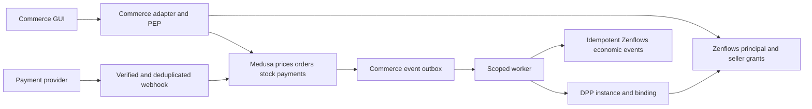

> **English edition.** [Italian version](../it/10-medusa-implications.md) · Technical terms and commit-pinned evidence are shared across both editions.

# 10 · Implications for MedusaJS

## What exists: a preview, not a marketplace

`lib/previewCommerce/mockData.ts` contains a demo product, a text seller, assembled/kit/bom variants, prices, stock lines, orders and mock address. `cart.tsx` maintains React state and persists variant/quantity in sessionStorage. Checkout uses a timeout and navigates to the order page; it does not create orders or reserve stock. The GSSP returns `publicPage: true` when the feature flag is active. There is no tenant isolation to evaluate as a current commerce implementation.

[interfacer-gui/lib/previewCommerce/mockData.ts:17–183](https://github.com/interfacerproject/interfacer-gui/blob/9afe601d4d28dd6ccc0b4db2092da65f8055823e/lib/previewCommerce/mockData.ts#L17-L183); [interfacer-gui/lib/previewCommerce/cart.tsx:23–110](https://github.com/interfacerproject/interfacer-gui/blob/9afe601d4d28dd6ccc0b4db2092da65f8055823e/lib/previewCommerce/cart.tsx#L23-L110); [interfacer-gui/pages/preview/commerce/checkout.tsx:64–80](https://github.com/interfacerproject/interfacer-gui/blob/9afe601d4d28dd6ccc0b4db2092da65f8055823e/pages/preview/commerce/checkout.tsx#L64-L80); [interfacer-gui/lib/previewCommerce/gssp.ts:26–36](https://github.com/interfacerproject/interfacer-gui/blob/9afe601d4d28dd6ccc0b4db2092da65f8055823e/lib/previewCommerce/gssp.ts#L26-L36).

The sales/inventory/orders/sell pages consume static data; `components/previewCommerce` presents buy block, pricing, onboarding and summary. The automatic passport issuing toggle is a UX proposal to fulfillment, not an implemented DPP job. [interfacer-gui/lib/previewCommerce/mockData.ts:207–365](https://github.com/interfacerproject/interfacer-gui/blob/9afe601d4d28dd6ccc0b4db2092da65f8055823e/lib/previewCommerce/mockData.ts#L207-L365).

## Assumptions not to be transferred to the backend

| Preview | Real prerequisite |
|---|---|
| Seller as unique string | Stable seller ID, legal entity, verified organization/person and mandate |
| Totals calculated in browser | Prices/taxes/discounts/shipping recalculated server-side |
| Static stocks and reserved | Single trade stock authority, atomic/idempotent reservations |
| A cart and a seller | Decide single-seller on first release or split order multi-seller |
| Order page reached by timeout | Order status from backend; no trust in redirect payment |
| Mock profile/address | Customer identity and consent; PII minimization for sellers |
| DPP label on order lines | Order-line-unit-passport binding and reconcilable issue status |
| Publication produced by UI | `listing.publish` with mandate, compliance and availability |

No Medusa release or native multi-vendor support is assumed: these choices require targeted spiking and testing of the selected release's API.

## Separation of rights

`resource.update` **does not imply** `listing.sell`. A contributor can improve the design without representing the manufacturer, owning the merchandise, or receiving payment. Open hardware license allows uses under legal conditions, does not automatically assign privileges on the seller accounts of others.

Seller offers its own offer linked to a public design without gaining control over that design. The controller of a design does not necessarily have to approve every independent seller: distinguish platform policy and licensing rights. If using the original manufacturer's DPP, manufacturer association and attestation require explicit rules.

| Proposed commerce action | Authorization |
|---|---|
| Create listing | Active seller, seller scope mandate, readable resource reference and license/compliance |
| Change prices or availability | Product manager seller; never client-supplied seller ID without verification |
| Manage inventory | Inventory role on seller location; authorization on each stock item |
| See order | Customer owner; seller only, own subordinate; support with motivation |
| Fulfillment | Authorized seller operator, appropriate order status |
| Refund | Finance role, amount/status limits, possible double approval |
| Change account payout | Seller legal admin, step-up auth; out-of-band audit and notification |
| Issue DPP instance | Worker scoped on verified fulfillment, non-generic admin |

Offboarding: remove membership revokes seller access/sessions/delegations, but does not change legal seller of historical orders nor legitimate customer access. Seller transfer and payout are not normal Organization edits.

## Proposed integration architecture

Customer ID Medusa ↔ principal Interfacer via unique mapping and secure federated/challenge login; not by declared email. Seller ID ↔ legal entity organisation/person + administered memberships. Store/customer API distinct from seller/admin API; do not expose Medusa admin credentials in the frontend.

Medusa authoritative for orders, prices and **commercial** stock. Zenflows authoritative for ValueFlows events/traceability. Decide whether onhand ValueFlows is projection of the commerce ledger or primary system for specific stocks: avoid two masters that update the same quantity without reconciliation. Events with origin ID, versioned mapping and deduplication, retry and dead-letter; no double decrement for replay.

DPP after purchase does not necessarily mean "on payment": the preview suggests fulfillment. For physical instances issue after serial assignment/fulfillment, with idempotency key order-line-unit. Returns/refunds do not erase history; add status/events without exposing customer data in the public passport.

## Webhooks and payments

**Future** risks, not confirmed Medusa vulnerabilities: webhook signature on raw body, timestamp/nonce and replay cache, source verification, amount/currency/order reconciliation; transaction with outbox and idempotency key. PSP is the authority on your financial outcome, not your browser's success page. No cards in DPP/Zenflows services or logs; use appropriate hosted/tokenized integration.

## Gate before integration

Stable principal and key bindings, membership/offboarding, seller scope and legal owner, resource/DPP permissions, auditing and idempotence, multi-seller test API and unavailability policy must exist before activating real purchases. [Roadmap stages 6–7](12-migration-roadmap.md).
