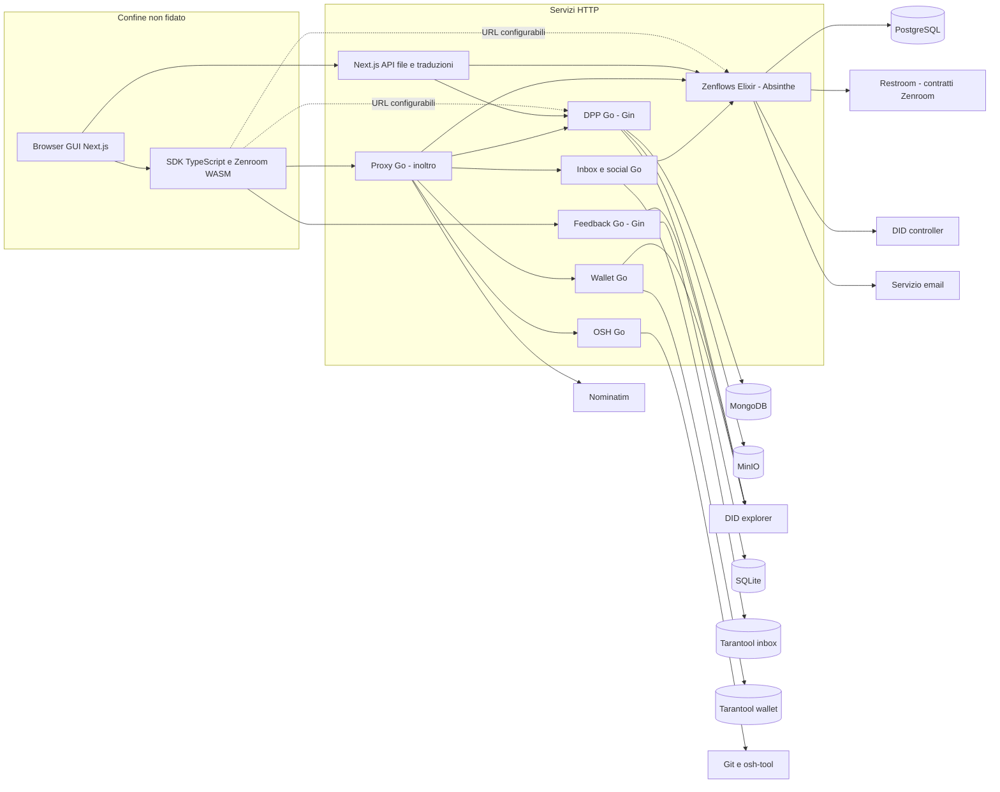

> **Edizione italiana.** [English version](../en/02-current-architecture.md) · Le evidenze fissate a commit e i termini tecnici sono condivisi tra le due edizioni.

# 02 · Architettura attuale

## Vista ricostruita dal codice

Le frecce indicano chiamate implementate/configurabili, non un inventario dei container realmente in produzione.

| Componente | Responsabilità e API | Persistenza / dipendenze | Confine di fiducia |
|---|---|---|---|
| interfacer-gui | Next.js/React; UI e API same-origin per file/traduzioni | localStorage per identità/chiavi; stato commerce nel browser | Il browser non può essere autorità di permesso |
| interfacer-client | SDK fetch GraphQL/REST, firma, risorse, file, inbox/wallet/social | Storage iniettato; Zenroom | Non è un enforcement server |
| interfacer-proxy | Prefissi Zenflows, DPP, inbox, wallet, OSH e geocoding | Nessun DB; URL da env | Inoltra metodo/body/header, non autentica |
| zenflows | ValueFlows, persone/org, eventi, risorse, processi, proposte, file | PostgreSQL via Ecto; Absinthe/Plug; Restroom; DID; email | Firma root GraphQL; dominio senza principal nei CRUD |
| interfacer-dpp | Passport CRUD, stato, allegati, QR | MongoDB `dpp_db`, MinIO; eseguibile `zencode-exec` | DID/firma solo in alcuni handler |
| interfacer-feedback-service | Recensioni, commenti, riepiloghi | SQLite WAL; publisher in-process di log | Middleware scritture; binding identità incompleto |
| zenflows-inbox | Messaggi e social ActivityStreams | Tarantool; lookup public key Zenflows | Messaggi firmati; social ha percorsi differenti |
| zenflows-wallet | Punti/token, saldo, transazioni | Tarantool; DID + Zenroom binding Go | Firma dell'operazione non limita chi può emettere punti |
| zenflows-crypto | Contratti Zencode e immagine di esecuzione | Nessun permission store | Verifica crittografica, non policy business |
| zenflows-osh | Analisi repository e shortlog | Git clone temporanei, `osh` CLI | Input esterno e accesso rete/filesystem |
| zenflows-fabaccess | Comandi ON/OFF e stato macchine | Fabaccess remoto, account configurato | DID/firma/timestamp prima dell'account condiviso |
| zenflows-bank | CLI export/list/airdrop | Tarantool, file, RPC Ethereum/Fabcoin | Comandi offline privilegiati, non checkout Medusa |

Fonti: [interfacer-proxy/main.go:67–143](https://github.com/interfacerproject/interfacer-proxy/blob/10d07344e2bcf7e3673f906e51aeb52cd6abf0cb/main.go#L67-L143); [zenflows/src/zenflows/web/router.ex:26–70](https://github.com/interfacerproject/zenflows/blob/893489d81fddf07e470094e72863958de402cca7/src/zenflows/web/router.ex#L26-L70); [interfacer-dpp/cmd/main/main.go:30–54](https://github.com/interfacerproject/interfacer-dpp/blob/5f6ae20380ae80716ac6a8742b69bdc82e141296/cmd/main/main.go#L30-L54); [interfacer-dpp/internal/database/database.go:19–81](https://github.com/interfacerproject/interfacer-dpp/blob/5f6ae20380ae80716ac6a8742b69bdc82e141296/internal/database/database.go#L19-L81); [interfacer-feedback-service/cmd/main/main.go:41–57](https://github.com/interfacerproject/interfacer-feedback-service/blob/d905a82a02d4115b13c87557591b7ddca6eb39b1/cmd/main/main.go#L41-L57); [interfacer-feedback-service/internal/database/database.go:18–116](https://github.com/interfacerproject/interfacer-feedback-service/blob/d905a82a02d4115b13c87557591b7ddca6eb39b1/internal/database/database.go#L18-L116); [zenflows-inbox/inbox.go:697–725](https://github.com/interfacerproject/zenflows-inbox/blob/963ae1d38116fb17ed35d6524ca7cfb8f16c0efd/inbox.go#L697-L725); [zenflows-wallet/wallet.go:218–224](https://github.com/interfacerproject/zenflows-wallet/blob/f5cf1668afe371329ed827d0bb56557e0bedcda6/wallet.go#L218-L224); [zenflows-fabaccess/main.py:55–123](https://github.com/interfacerproject/zenflows-fabaccess/blob/8294b50a9e97f2ef85ad72fc0bc0cff66af33cfc/main.py#L55-L123); [zenflows-bank/cmd/airdrop.go:31–125](https://github.com/interfacerproject/zenflows-bank/blob/e5c2d2e6bd1ad072d1575de0a2be983854429b35/cmd/airdrop.go#L31-L125).

## API pubbliche e interne

- Zenflows espone `/api`, `/api/file`, `/play` e `/schema`. GraphiQL è un altro ingresso allo stesso schema, non un'autorizzazione diversa.
- Il proxy registra prefissi fissi: non è un proxy arbitrario per ogni URL, ma nemmeno un API gateway di sicurezza. Non vi è routing feedback nel commit analizzato; la GUI usa `feedbackUrl` configurabile.
- DPP ascolta su `:8080`, feedback su `:8081`. Il compose DPP pubblica anche MongoDB e MinIO e configura download anonimo del bucket. **Queste sono proprietà del file compose, non prova di esposizione Internet.**
- Restroom riceve dal server body e chiavi pubbliche per verifica, shard/salt per Keypairoom, ed eventualmente keyring per firma DID. Va trattato come parte del perimetro crittografico, non un servizio innocuo accessibile a tutti.
- Non è presente nel codice esaminato un protocollo universale di service identity o delega. Inbox e bank contengono credenziali/configurazioni per effettuare richieste a nome di un agent; DPP risolve il DID ma non chiede permessi a Zenflows.

Evidenze: [interfacer-proxy/main.go:160–241](https://github.com/interfacerproject/interfacer-proxy/blob/10d07344e2bcf7e3673f906e51aeb52cd6abf0cb/main.go#L160-L241); [interfacer-gui/contexts/AuthContext.tsx:81–109](https://github.com/interfacerproject/interfacer-gui/blob/9afe601d4d28dd6ccc0b4db2092da65f8055823e/contexts/AuthContext.tsx#L81-L109); [interfacer-dpp/docker-compose.yml:3–61](https://github.com/interfacerproject/interfacer-dpp/blob/5f6ae20380ae80716ac6a8742b69bdc82e141296/docker-compose.yml#L3-L61); [zenflows/src/zenflows/restroom.ex:47–133](https://github.com/interfacerproject/zenflows/blob/893489d81fddf07e470094e72863958de402cca7/src/zenflows/restroom.ex#L47-L133); [zenflows/src/zenflows/did.ex:63–112](https://github.com/interfacerproject/zenflows/blob/893489d81fddf07e470094e72863958de402cca7/src/zenflows/did.ex#L63-L112).

## Deployment e versioni

Zenflows propone server + PostgreSQL + immagine `zenflows-crypto`; le immagini `latest` non fissano il codice effettivamente eseguito. Il Dockerfile usa release Elixir e utente non root. DPP propone MongoDB/MinIO/app con bootstrap bucket; non assumere che il compose sia il deployment della piattaforma pubblica. GUI ha build Next standalone e workflow di pubblicazione preesistenti; non sono stati modificati.

[zenflows/devop/.docker-compose.templ:1–43](https://github.com/interfacerproject/zenflows/blob/893489d81fddf07e470094e72863958de402cca7/devop/.docker-compose.templ#L1-L43); [interfacer-dpp/docker-compose.yml:3–61](https://github.com/interfacerproject/interfacer-dpp/blob/5f6ae20380ae80716ac6a8742b69bdc82e141296/docker-compose.yml#L3-L61). [Commit, submodule e deployment da verificare](appendix/repository-map.md).

## Modello di progetto effettivo

La GUI chiama «progetto» una composizione di `EconomicResource`, `ResourceSpecification`, `Process` ed eventi. Il SDK crea prima process/location, poi un evento che produce la risorsa. Esistono anche `Proposal` e `Intent`, ma non sono una tabella ACL né un'entità seller.

[interfacer-client/src/resources/ResourceClient.ts:141–245](https://github.com/interfacerproject/interfacer-client/blob/dfb1baabf16516a845957d5587ccb933c1874221/src/resources/ResourceClient.ts#L141-L245). Le relazioni contributive passano da eventi e metadata/notifiche: [interfacer-gui/hooks/useProjectCRUD.ts:67–119](https://github.com/interfacerproject/interfacer-gui/blob/9afe601d4d28dd6ccc0b4db2092da65f8055823e/hooks/useProjectCRUD.ts#L67-L119). Queste chiamate multiple non costituiscono una transazione distribuita.

## Trust boundary da non perdere

1. Browser → qualsiasi URL servizio: tutti gli ID di input sono dichiarazioni.
2. Gateway → backend: inoltrare un header non lo rende attendibile.
3. Resolver → dominio → DB: un controllo solo GraphQL non copre import e job.
4. Zenflows → DPP: collegamenti semantici, senza FK cross-database o decisione autorizzativa attuale.
5. Applicazione → DID/Restroom/Fabaccess/Git: dipendenze esterne con privilegi e disponibilità proprie.
6. Risposta pubblica → relazioni/file/cache: la policy deve coprire l'intero grafo restituito, non solo l'oggetto root.
