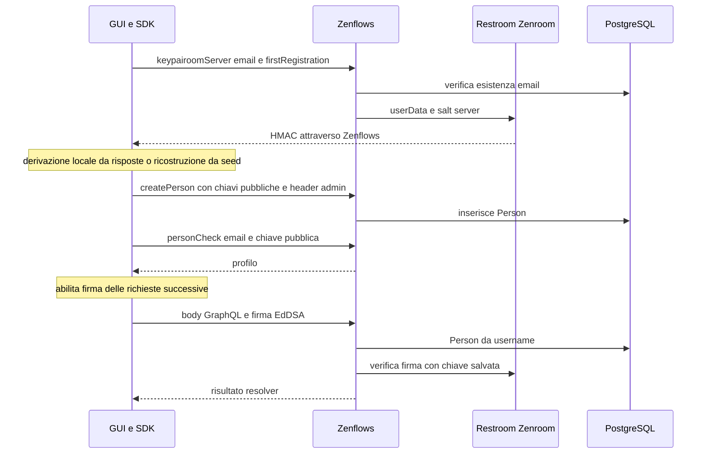

> **Edizione italiana.** [English version](../en/03-authentication-analysis.md) · Le evidenze fissate a commit e i termini tecnici sono condivisi tra le due edizioni.

# 03 · Autenticazione

## Registrazione, login e ripristino

1. `requestHmac` chiama `keypairoomServer`, guest. Il backend controlla l'esistenza dell'email in funzione di `firstRegistration`; non dimostra possesso della casella in questo passaggio. [zenflows/src/zenflows/keypairoom/domain.ex:30–40](https://github.com/interfacerproject/zenflows/blob/893489d81fddf07e470094e72863958de402cca7/src/zenflows/keypairoom/domain.ex#L30-L40); [interfacer-client/src/auth/AuthClient.ts:51–241](https://github.com/interfacerproject/interfacer-client/blob/dfb1baabf16516a845957d5587ccb933c1874221/src/auth/AuthClient.ts#L51-L241).
2. Il browser deriva le chiavi da cinque risposte personali e shard HMAC o le ricostruisce da seed e HMAC. Il SDK persiste EdDSA, Ethereum, Reflow, Bitcoin, ECDH e seed. [interfacer-client/src/crypto/keypair.ts:47–144](https://github.com/interfacerproject/interfacer-client/blob/dfb1baabf16516a845957d5587ccb933c1874221/src/crypto/keypair.ts#L47-L144).
3. `createPerson` è **admin-only** nello schema, non una normale mutation firmata; il SDK può inviare `zenflows-admin`. La GUI configura il client nel browser. Il lifecycle di questa credenziale richiede intervento prioritario, con dettagli operativi nel rapporto riservato. [zenflows/src/zenflows/vf/person/type.ex:179–270](https://github.com/interfacerproject/zenflows/blob/893489d81fddf07e470094e72863958de402cca7/src/zenflows/vf/person/type.ex#L179-L270); [interfacer-client/src/auth/AuthClient.ts:51–241](https://github.com/interfacerproject/interfacer-client/blob/dfb1baabf16516a845957d5587ccb933c1874221/src/auth/AuthClient.ts#L51-L241); [interfacer-gui/contexts/AuthContext.tsx:81–109](https://github.com/interfacerproject/interfacer-gui/blob/9afe601d4d28dd6ccc0b4db2092da65f8055823e/contexts/AuthContext.tsx#L81-L109).
4. Login usa `personCheck(email, eddsaPublicKey)`, guest, per recuperare il profilo. Non è una challenge di possesso della privata e non genera una sessione server. La prova di possesso avviene nelle successive richieste firmate, non nel booleano `authenticated` della GUI. [zenflows/src/zenflows/vf/person/resolv.ex:38–85](https://github.com/interfacerproject/zenflows/blob/893489d81fddf07e470094e72863958de402cca7/src/zenflows/vf/person/resolv.ex#L38-L85).
5. Ripristino dal localStorage e logout sono operazioni locali; `logout()` cancella storage e disabilita firma, **non revoca una chiave già copiata**. [interfacer-gui/contexts/AuthContext.tsx:242–302](https://github.com/interfacerproject/interfacer-gui/blob/9afe601d4d28dd6ccc0b4db2092da65f8055823e/contexts/AuthContext.tsx#L242-L302); [interfacer-client/src/auth/AuthClient.ts:51–241](https://github.com/interfacerproject/interfacer-client/blob/dfb1baabf16516a845957d5587ccb933c1874221/src/auth/AuthClient.ts#L51-L241).

## Firma e identificazione in Zenflows

Il SDK serializza query/variables/operationName, firma e invia `zenflows-user`, `zenflows-sign`, `zenflows-hash`. Il server usa raw body, username e firma; il middleware cerca la Person per username e verifica con la sua EdDSA public key. Solo allora scrive `req_user` nel contesto.

[interfacer-client/src/graphql/GraphQLClient.ts:27–84](https://github.com/interfacerproject/interfacer-client/blob/dfb1baabf16516a845957d5587ccb933c1874221/src/graphql/GraphQLClient.ts#L27-L84); [interfacer-client/src/crypto/sign.ts:36–137](https://github.com/interfacerproject/interfacer-client/blob/dfb1baabf16516a845957d5587ccb933c1874221/src/crypto/sign.ts#L36-L137); [zenflows/src/zenflows/web/mw/gql_context.ex:34–68](https://github.com/interfacerproject/zenflows/blob/893489d81fddf07e470094e72863958de402cca7/src/zenflows/web/mw/gql_context.ex#L34-L68); [zenflows/src/zenflows/gql/mw/sign.ex:28–72](https://github.com/interfacerproject/zenflows/blob/893489d81fddf07e470094e72863958de402cca7/src/zenflows/gql/mw/sign.ex#L28-L72).

Il contratto effettua normalizzazione degli spazi/stringhe prima della verifica; quindi non descrivere il meccanismo come firma rigorosa di ogni byte HTTP. Non include metodo, path, audience, nonce o scadenza. L'hash inviato dal SDK non è usato dal middleware Sign come controllo autonomo. [zenflows-crypto/src/verify_graphql.zen:17–44](https://github.com/interfacerproject/zenflows-crypto/blob/0ffcce9b90799c9cb61f11fc594aeb513a01326f/src/verify_graphql.zen#L17-L44).

**Rischio da verificare:** semantica della normalizzazione su valori stringa; occorrono vettori di test con whitespace significativo. **Limitazione confermata:** nessun controllo freshness nei percorsi GraphQL esaminati; una firma riutilizzata può restare valida, ma gli effetti dipendono dalla mutation e dai vincoli DB.

`GQL_AUTH_CALLS` è true per default; se impostato a false, Sign e Admin non verificano le credenziali. Non è stata verificata la configurazione live. Un header admin presente impedisce al middleware context di leggere gli header utente: l'admin non è automaticamente un superuser universale per tutte le mutation firmate. [zenflows/conf/runtime.exs:89–131](https://github.com/interfacerproject/zenflows/blob/893489d81fddf07e470094e72863958de402cca7/conf/runtime.exs#L89-L131); [zenflows/src/zenflows/gql/mw/admin.ex:28–42](https://github.com/interfacerproject/zenflows/blob/893489d81fddf07e470094e72863958de402cca7/src/zenflows/gql/mw/admin.ex#L28-L42); [zenflows/src/zenflows/web/mw/gql_context.ex:34–68](https://github.com/interfacerproject/zenflows/blob/893489d81fddf07e470094e72863958de402cca7/src/zenflows/web/mw/gql_context.ex#L34-L68).

## Chiavi, recupero e revoca

| Aspetto | Implementazione osservata | Conseguenza / lavoro necessario |
|---|---|---|
| Storage browser | localStorage adapter e copie esplicite di seed/chiavi | Qualsiasi JavaScript malevolo same-origin può leggerle; non prova di XSS sfruttata |
| Rotazione Person | Chiavi presenti in create; update GraphQL non le espone e changeset update non le include | Progettare rotazione autenticata e recupero, non edit manuali ordinari |
| Revoca account | `deletePerson` admin; nessun registro di sessioni/chiavi revocate nei percorsi analizzati | FK possono ostacolare delete; disabilitazione esplicita preferibile |
| Verifica email | Resolver usa `req_user`, poi token HMAC nel dominio email | Esempio positivo di binding all'attore; verifica email non è requisito universale Sign |
| DID claim | `claimPerson(id)` firmata, resolver usa ID input; server firma richiesta con proprio keyring | Limitare a self o delega esplicita; valutare controller e revoca DID separatamente |
| Credenziali tecniche | Env/static configuration per admin, DID signing, DB, storage, Fabaccess | Identità distinte, scopi minimi, rotazione e inventario dei consumer |

[interfacer-client/src/config/storage.ts:1–40](https://github.com/interfacerproject/interfacer-client/blob/dfb1baabf16516a845957d5587ccb933c1874221/src/config/storage.ts#L1-L40); [zenflows/src/zenflows/vf/person.ex:44–111](https://github.com/interfacerproject/zenflows/blob/893489d81fddf07e470094e72863958de402cca7/src/zenflows/vf/person.ex#L44-L111); [zenflows/src/zenflows/vf/person/type.ex:179–270](https://github.com/interfacerproject/zenflows/blob/893489d81fddf07e470094e72863958de402cca7/src/zenflows/vf/person/type.ex#L179-L270); [zenflows/src/zenflows/vf/person/resolv.ex:38–85](https://github.com/interfacerproject/zenflows/blob/893489d81fddf07e470094e72863958de402cca7/src/zenflows/vf/person/resolv.ex#L38-L85); [zenflows/src/zenflows/did.ex:63–112](https://github.com/interfacerproject/zenflows/blob/893489d81fddf07e470094e72863958de402cca7/src/zenflows/did.ex#L63-L112).

### Scadenza email: eccezione importante

Il binding token→persona e l'HMAC sono presenti, ma il confronto temporale usa `issued_at < now + expiry`: non rifiuta i token vecchi. [F11, evidenza e verifica locale](04-authorization-audit.md#f11-predicato-di-scadenza-email-invertito-confermato-p1). Correggere il predicato e aggiungere test di scadenza senza eliminare i controlli self/HMAC.

Le risposte personali usate per derivazione possono avere entropia limitata: è un rischio di design da misurare con i maintainer e il protocollo Keypairoom, non una dimostrazione di recupero delle chiavi. Non considerarle equivalenti a segreti casuali ad alta entropia.

## Organizzazioni e altri servizi

Sign identifica una **Person**, non un'organizzazione selezionata nella GUI. Organization e AgentRelationship esistono, ma non un contesto autenticato `acting_for` con membership verificata nei percorsi esaminati. Inserire un organization ID in provider/receiver non prova la delega.

DPP e wallet accettano chiave dichiarata e verificano firma + risoluzione DID con risposta HTTP 200; non caricano automaticamente la Person Zenflows. Il feedback aggiunge un user ID separato. Inbox è un contrasto utile: recupera la chiave del sender/receiver indicato nel body e verifica quella firma. [interfacer-dpp/internal/auth/auth.go:98–151](https://github.com/interfacerproject/interfacer-dpp/blob/5f6ae20380ae80716ac6a8742b69bdc82e141296/internal/auth/auth.go#L98-L151); [zenflows-wallet/did-auth.go:43–78](https://github.com/interfacerproject/zenflows-wallet/blob/f5cf1668afe371329ed827d0bb56557e0bedcda6/did-auth.go#L43-L78); [interfacer-feedback-service/internal/auth/middleware.go:15–88](https://github.com/interfacerproject/interfacer-feedback-service/blob/d905a82a02d4115b13c87557591b7ddca6eb39b1/internal/auth/middleware.go#L15-L88); [zenflows-inbox/zenflows-auth.go:11–36](https://github.com/interfacerproject/zenflows-inbox/blob/963ae1d38116fb17ed35d6524ca7cfb8f16c0efd/zenflows-auth.go#L11-L36); [zenflows-inbox/inbox.go:80–243](https://github.com/interfacerproject/zenflows-inbox/blob/963ae1d38116fb17ed35d6524ca7cfb8f16c0efd/inbox.go#L80-L243).

## Proposta incrementale

Mantenere EdDSA per compatibilità iniziale, ma centralizzare il binding **chiave verificata → subject stabile**, con account/chiavi attivi. Per nuove operazioni usare envelope versionato con metodo/path/body digest, audience, request ID e tempo, e replay cache server. Non introdurre JWT solo per cambiare formato: servono issuer, verifica, audience, revoca e scopi. Per browser valutare una futura sessione BFF HttpOnly dopo challenge, senza migrare contemporaneamente tutto il key management. [Architettura proposta](09-proposed-architecture.md).
