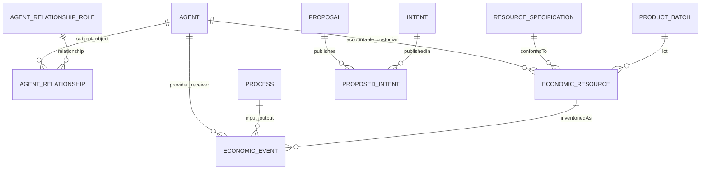

> **Edizione italiana.** [English version](../en/05-zenflows-analysis.md) · Le evidenze fissate a commit e i termini tecnici sono condivisi tra le due edizioni.

# 05 · Zenflows e ValueFlows

## Modello attuale e semantica

Diagramma semantico, non DDL completo. Person e Organization sono viste/schema del mondo Agent, non utenti/tenant separati con ACL native. [zenflows/src/zenflows/vf/person.ex:44–111](https://github.com/interfacerproject/zenflows/blob/893489d81fddf07e470094e72863958de402cca7/src/zenflows/vf/person.ex#L44-L111); [zenflows/src/zenflows/vf/agent_relationship.ex:34–64](https://github.com/interfacerproject/zenflows/blob/893489d81fddf07e470094e72863958de402cca7/src/zenflows/vf/agent_relationship.ex#L34-L64); [zenflows/src/zenflows/vf/economic_resource.ex:83–157](https://github.com/interfacerproject/zenflows/blob/893489d81fddf07e470094e72863958de402cca7/src/zenflows/vf/economic_resource.ex#L83-L157). [Dettaglio dati](appendix/data-model.md).

| Concetto | Osservato | Riutilizzo consentito per permessi |
|---|---|---|
| Agent / Person | Identità persona e chiavi pubbliche; Sign cerca Person | ID persona come subject stabile, con stato account e chiavi aggiunti |
| Organization | Agent economico con CRUD ordinario | ID come scope; non membership implicita |
| AgentRelationship | subject/object/relationship; `in_scope_of` commentato | Legame descrittivo; membership amministrativa solo dopo workflow e protezione |
| EconomicResource | Responsabilità, custodia, specifica, quantità, metadata, previousEvent | ID oggetto; non derivare grant da metadata arbitrari |
| EconomicEvent | provider/receiver, action, processo, risorse, quantità; side effect | Fonte di provenance ed effetti da autorizzare, non delega |
| Process / ProcessGroup | Organizzazione delle attività, grouping con invarianti | Eventuale associazione a project scope esplicito |
| Proposal / Intent | Proposte e intenti economici, collegamenti publishes | Non seller account, non invito accettato o ACL |
| primaryAccountable | Responsabilità economica, inizializzata da receiver nella produzione | Attributo business e possibile indizio per migrazione, non titolo amministrativo |
| custodian | Custodia fisica/onhand | Permessi logistici solo tramite grant dedicato, non edit di specifiche |

## Creazione di una risorsa: percorso completo

GUI `useProjectCRUD` → SDK `createProject` → crea Process/location → `createEconomicEvent` con `produce` e nuova risorsa → MW.Sign → resolver ignora context → `Domain.create` → Ecto.Multi → changeset evento → `handle_insert` → `EconomicResource.Domain.multi_insert` → PostgreSQL.

Il SDK sceglie agent dallo storage utente; il server non può assumere che un altro client faccia lo stesso. La creazione assegna primaryAccountable e custodian al receiver dell'evento; non registra automaticamente un amministratore verificato.

[interfacer-client/src/resources/ResourceClient.ts:141–245](https://github.com/interfacerproject/interfacer-client/blob/dfb1baabf16516a845957d5587ccb933c1874221/src/resources/ResourceClient.ts#L141-L245); [zenflows/src/zenflows/vf/economic_event/resolv.ex:38–49](https://github.com/interfacerproject/zenflows/blob/893489d81fddf07e470094e72863958de402cca7/src/zenflows/vf/economic_event/resolv.ex#L38-L49); [zenflows/src/zenflows/vf/economic_event/domain.ex:124–285](https://github.com/interfacerproject/zenflows/blob/893489d81fddf07e470094e72863958de402cca7/src/zenflows/vf/economic_event/domain.ex#L124-L285).

## Aggiornamento e percorsi indiretti

- Aggiornamento diretto: GraphQL limita i campi, ma non l'attore. `Domain.update` usa un changeset più ampio dell'input GraphQL. Questo è importante per job/import e per future API.
- Aggiornamento metadata via SDK: crea un processo e registra eventi `accept`/`modify` secondo le operazioni GraphQL del client; autorizzare la sequenza e non soltanto il setter diretto.
- Trasferimenti: `transferAllRights` riguarda accounting/primaryAccountable; `transferCustody` riguarda onhand/custodian; `transfer` combina effetti. Quantità e destinazioni producono aggiornamenti o nuove risorse, anche su contenuti di un container.
- `cite`/`use`: modificano lineage/previousEvent anche se non trasferiscono ownership. Un permesso di citare pubblicamente non deve diventare permesso di alterare la risorsa citata senza una semantica approvata.
- Organization/AgentRelationship CRUD può modificare la base di una futura ReBAC. Non attivare ereditarietà prima di proteggere la scrittura delle relazioni.
- File: associazioni ricreate durante aggiornamenti; cancellazione delle associazioni e cleanup devono ereditare policy dell'oggetto, non essere una scorciatoia.

[zenflows/src/zenflows/vf/economic_resource/type.ex:224–353](https://github.com/interfacerproject/zenflows/blob/893489d81fddf07e470094e72863958de402cca7/src/zenflows/vf/economic_resource/type.ex#L224-L353); [zenflows/src/zenflows/vf/economic_resource/domain.ex:246–332](https://github.com/interfacerproject/zenflows/blob/893489d81fddf07e470094e72863958de402cca7/src/zenflows/vf/economic_resource/domain.ex#L246-L332); [interfacer-client/src/resources/ResourceClient.ts:285–350](https://github.com/interfacerproject/interfacer-client/blob/dfb1baabf16516a845957d5587ccb933c1874221/src/resources/ResourceClient.ts#L285-L350); [zenflows/src/zenflows/vf/economic_event/domain.ex:782–909](https://github.com/interfacerproject/zenflows/blob/893489d81fddf07e470094e72863958de402cca7/src/zenflows/vf/economic_event/domain.ex#L782-L909); [zenflows/src/zenflows/vf/agent_relationship/resolv.ex:36–51](https://github.com/interfacerproject/zenflows/blob/893489d81fddf07e470094e72863958de402cca7/src/zenflows/vf/agent_relationship/resolv.ex#L36-L51); [zenflows/src/zenflows/file/domain.ex:67–123](https://github.com/interfacerproject/zenflows/blob/893489d81fddf07e470094e72863958de402cca7/src/zenflows/file/domain.ex#L67-L123).

## Cosa manca per collaborazione e organizzazioni

Nei modelli esaminati non sono rappresentati membership amministrativa con invito/accettazione/revoca, owner amministrativo immutabile rispetto ai normali edit, delegato con scopi/scadenza, ACL resource-scoped, seller commerciale verificato. I contributor nel frontend sono metadata/eventi/notifiche; `addContributor` nel commit GUI chiama un metodo SDK che usa l'utente corrente, mentre il destinatario della notifica è un parametro separato: non è una prova affidabile del consenso del contributor.

[interfacer-gui/hooks/useProjectCRUD.ts:67–119](https://github.com/interfacerproject/interfacer-gui/blob/9afe601d4d28dd6ccc0b4db2092da65f8055823e/hooks/useProjectCRUD.ts#L67-L119); [interfacer-client/src/resources/ResourceClient.ts:285–350](https://github.com/interfacerproject/interfacer-client/blob/dfb1baabf16516a845957d5587ccb933c1874221/src/resources/ResourceClient.ts#L285-L350). La modifica locale preesistente di questo hook non è stata sovrascritta e non viene usata come prova commit-pinned.

## Migrazione delle responsabilità

Non rinominare `primaryAccountable` in `owner`. Conservare storia economica e aggiungere `administrative_controller` come relazione autorizzativa separata. Per nuove risorse: creator verificato ottiene amministrazione personale solo se crea per sé; se crea per organizzazione, il controllo appartiene all'organizzazione dopo verifica di delega. Per risorse storiche: candidate e prove, decisione esplicita, audit. L'import che usa la prima email rende particolarmente pericoloso un backfill automatico. [zenflows/src/zenflows/sw_pass/domain.ex:108–197](https://github.com/interfacerproject/zenflows/blob/893489d81fddf07e470094e72863958de402cca7/src/zenflows/sw_pass/domain.ex#L108-L197).

## Punto di enforcement proposto

Application service/domain entrypoint riceve `ExecutionContext(subject, service, acting_for, request_id)`; carica oggetti e membership, autorizza in transazione, valida invarianti, persiste e registra audit. `multi_*` e chiamate raw non devono restare un'alternativa pubblica priva di contesto. Non è necessario introdurre RLS al primo passo, ma i permessi DB delle applicazioni non devono includere accessi ai DB degli altri servizi.
