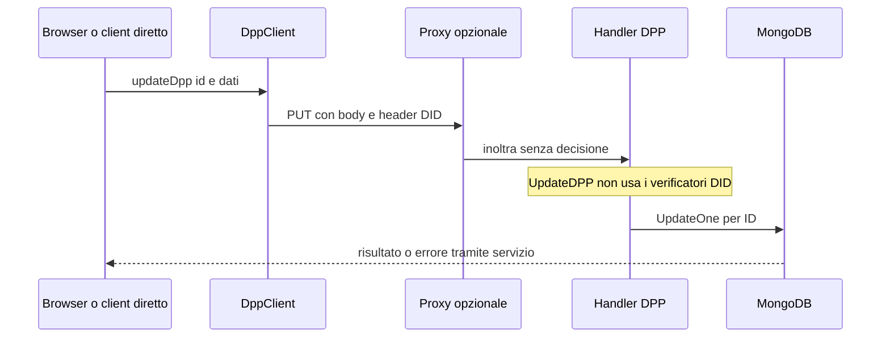

> **Edizione italiana.** [English version](../en/06-dpp-analysis.md) · Le evidenze fissate a commit e i termini tecnici sono condivisi tra le due edizioni.

# 06 · Digital Product Passport

## Ciclo implementato

| Operazione | Comportamento reale | Controllo attuale |
|---|---|---|
| Creazione | JSON→struct, nuovo ULID, date server, default draft | DID HTTP 200 + firma body; nessuna verifica productId/organizzazione |
| Lettura singola/lista | MongoDB per ID o filtri facoltativi, search/facet | Nessuna policy visibilità/status |
| Aggiornamento | Bind struct e `$set`; include campi di sistema | Nessuna auth nell'handler; possibile errore `_id` immutabile |
| Cancellazione | DeleteOne per ID | Nessuna auth nell'handler; non una cancellazione distribuita di tutte le copie |
| Pubblicazione/archivio | `draft→active/archived`, `active→archived`, `archived→draft` | Validazione transizione, non permesso di pubblicare |
| Upload generico | Hash SHA-256, firma, MinIO, URL e metadata | DID/firma; nessun parent object autorizzato |
| Add attachment | Upload e push su `attachments.<section>` | DID/firma checksum, non policy DPP/sezione |
| Delete attachment | Rimozione da Mongo e MinIO best effort | Nessuna auth nell'handler |
| QR | PNG di URL pubblico costruito con ID valido | Non prova esistenza, proprietà o autenticità del contenuto |

Fonti: [interfacer-dpp/cmd/main/main.go:30–54](https://github.com/interfacerproject/interfacer-dpp/blob/5f6ae20380ae80716ac6a8742b69bdc82e141296/cmd/main/main.go#L30-L54); [interfacer-dpp/internal/handler/handler.go:41–116](https://github.com/interfacerproject/interfacer-dpp/blob/5f6ae20380ae80716ac6a8742b69bdc82e141296/internal/handler/handler.go#L41-L116); [interfacer-dpp/internal/handler/handler.go:154–224](https://github.com/interfacerproject/interfacer-dpp/blob/5f6ae20380ae80716ac6a8742b69bdc82e141296/internal/handler/handler.go#L154-L224); [interfacer-dpp/internal/handler/handler.go:480–551](https://github.com/interfacerproject/interfacer-dpp/blob/5f6ae20380ae80716ac6a8742b69bdc82e141296/internal/handler/handler.go#L480-L551); [interfacer-dpp/internal/handler/handler.go:348–478](https://github.com/interfacerproject/interfacer-dpp/blob/5f6ae20380ae80716ac6a8742b69bdc82e141296/internal/handler/handler.go#L348-L478); [interfacer-dpp/internal/handler/handler.go:553–674](https://github.com/interfacerproject/interfacer-dpp/blob/5f6ae20380ae80716ac6a8742b69bdc82e141296/internal/handler/handler.go#L553-L674); [interfacer-dpp/internal/handler/handler.go:676–753](https://github.com/interfacerproject/interfacer-dpp/blob/5f6ae20380ae80716ac6a8742b69bdc82e141296/internal/handler/handler.go#L676-L753).

## Collegamenti con Zenflows

Due forme coesistono nel codice:

1. Il form DPP autonomo seleziona prodotti con filtro GUI `primaryAccountable = user.ulid`, poi invia `productId`, `batchType` (`batch` o `unit`) e `batchId`. Il filtro è UX, non controllo backend. [interfacer-gui/components/partials/create/dpp/CreateDppForm.tsx:124–231](https://github.com/interfacerproject/interfacer-gui/blob/9afe601d4d28dd6ccc0b4db2092da65f8055823e/components/partials/create/dpp/CreateDppForm.tsx#L124-L231).
2. Il SDK può creare una EconomicResource di specifica DPP con metadata `dppServiceUlid`. [interfacer-client/src/resources/ResourceClient.ts:141–245](https://github.com/interfacerproject/interfacer-client/blob/dfb1baabf16516a845957d5587ccb933c1874221/src/resources/ResourceClient.ts#L141-L245).

Nel servizio DPP `ProductID` è una stringa senza lookup Zenflows. `EconomicOperator` contiene dati descrittivi aziendali (nome, GLN/EORI, indirizzo), non una membership Organization verificata. `createdBy` può essere ULID o public key. L'indice parziale unique productId+batchId tenta di evitare duplicati, ma gli errori di creazione degli indici vengono solo loggati: verificare effettiva installazione e compatibilità versione MongoDB.

[interfacer-dpp/internal/model/model.go:25–51](https://github.com/interfacerproject/interfacer-dpp/blob/5f6ae20380ae80716ac6a8742b69bdc82e141296/internal/model/model.go#L25-L51); [interfacer-dpp/internal/model/model.go:127–147](https://github.com/interfacerproject/interfacer-dpp/blob/5f6ae20380ae80716ac6a8742b69bdc82e141296/internal/model/model.go#L127-L147); [interfacer-dpp/internal/database/database.go:19–81](https://github.com/interfacerproject/interfacer-dpp/blob/5f6ae20380ae80716ac6a8742b69bdc82e141296/internal/database/database.go#L19-L81).

## Un edit DPP oggi

[interfacer-client/src/dpp/DppClient.ts:27–149](https://github.com/interfacerproject/interfacer-client/blob/dfb1baabf16516a845957d5587ccb933c1874221/src/dpp/DppClient.ts#L27-L149); [interfacer-proxy/main.go:160–241](https://github.com/interfacerproject/interfacer-proxy/blob/10d07344e2bcf7e3673f906e51aeb52cd6abf0cb/main.go#L160-L241); [interfacer-dpp/internal/handler/handler.go:154–224](https://github.com/interfacerproject/interfacer-dpp/blob/5f6ae20380ae80716ac6a8742b69bdc82e141296/internal/handler/handler.go#L154-L224). La presenza di header firmati nel SDK **non prova** che il backend li controlli; il commento SDK «all endpoints authenticated» non corrisponde all'implementazione. Inoltre le chiamate senza body non producono firma in `signedRequest`.

## Modello sufficiente? Non ancora

Il documento contiene sezioni tipizzate, product/batch e campi di riparazione. Non rappresenta un ledger di riparazioni con attore verificato/versione/firma per evento, né design/model/batch/instance/listing come entità distinte e vincolate. `RepairInformation` è una struttura descrittiva singola, non una sequenza append-only.

**Proposta**, da validare con dominio DPP:

| Entità logica | Identità / relazione | Policy |
|---|---|---|
| Design | EconomicResource di progetto e versione | Collaborazione tecnica |
| Modello prodotto | Resource ID e revisione di specifica | Produttore autorizzato |
| Lotto | Batch ID scoped al modello e produttore | Qualità/manifattura |
| Esemplare | ID stabile e seriale, eventuale lotto | Custodia, riparazioni, stato; proprietà personale riservata |
| Listing | ID Medusa, seller e variante | Vendita; non equivale a modello o DPP |
| Passport | ID DPP, subject tipizzato, parent resource immutabile/versionato | Permessi di base dalla risorsa, policy sezioni nel DPP |

Evitare di duplicare tutto ValueFlows in MongoDB: aggiungere binding autorevole e versioni, non un secondo grafo economico indipendente. Ogni cambio di parent o produttore è un comando privilegiato con controllo su origine/destinazione, non un campo di un PUT generico.

## Policy sezioni proposta

| Sezione / azione | Attori ammessi, a parità di scope | Limiti |
|---|---|---|
| Specifiche prodotto, identità produttore | Manufacturer editor; publisher per rilascio | Versione pubblicata immutabile, correzione come revisione |
| Ambiente/materiali | Sustainability editor delegato | Evidenze e approvazione per claim pubblici |
| Certificazioni | Certifier/quality reviewer esplicito | Attribuzione issuer e allegato verificabile, non autodichiarazione implicita |
| Riparazioni/manutenzione | Repair operator per istanza autorizzata | Solo append; non modifica specifiche originarie |
| Proprietà/contatti | Controller/privacy role e interessato secondo finalità | Nessun indirizzo del compratore nella proiezione pubblica |
| Allegati | Stesso scope della sezione più permesso attach/remove | Private storage, MIME verificato, origine download separata |
| Pubblicazione/ritiro | DPP publisher | Controlli di completezza, audit, retention |
| Eliminazione bozza | Controller delegato | No hard-delete indiscriminato di passport pubblicati |

Per ogni edit ordinario richiedere sia diritto sulla risorsa sia diritto DPP specifico. L'append riparazione è un **permesso diverso**, non un modo di aggirare il divieto di edit della risorsa. Un repair grant non dà `resource.update`, `dpp.spec.update` o `dpp.publish`.

## Concorrenza, consistenza e allegati

`UpdateDPPStatus` legge stato e aggiorna per ID, senza includere lo stato letto nel predicato: una futura implementazione deve usare compare-and-swap (`version`, stato atteso) e autorizzare la transizione effettiva. Un generic PUT oggi non applica le stesse transizioni: unificarle nel dominio.

AddAttachment carica prima su storage poi aggiorna Mongo; errori possono lasciare orfani. DeleteAttachment rimuove storage best effort. Usare staging/quarantena, commit del riferimento, cleanup idempotente. Mai usare il solo checksum come capability: il digest dimostra contenuto, non destinatario, accesso o autore.

Il SDK addAttachment firma checksum via `signDidRequest` (base64 del testo), mentre server passa checksum raw al contratto base64; upload generico ha un helper distinto. **Potenziale incompatibilità da testare**, non si presume funzionamento né bypass crittografico. [interfacer-client/src/crypto/sign.ts:36–137](https://github.com/interfacerproject/interfacer-client/blob/dfb1baabf16516a845957d5587ccb933c1874221/src/crypto/sign.ts#L36-L137); [interfacer-client/src/dpp/DppClient.ts:27–149](https://github.com/interfacerproject/interfacer-client/blob/dfb1baabf16516a845957d5587ccb933c1874221/src/dpp/DppClient.ts#L27-L149); [interfacer-dpp/internal/handler/handler.go:553–674](https://github.com/interfacerproject/interfacer-dpp/blob/5f6ae20380ae80716ac6a8742b69bdc82e141296/internal/handler/handler.go#L553-L674).
