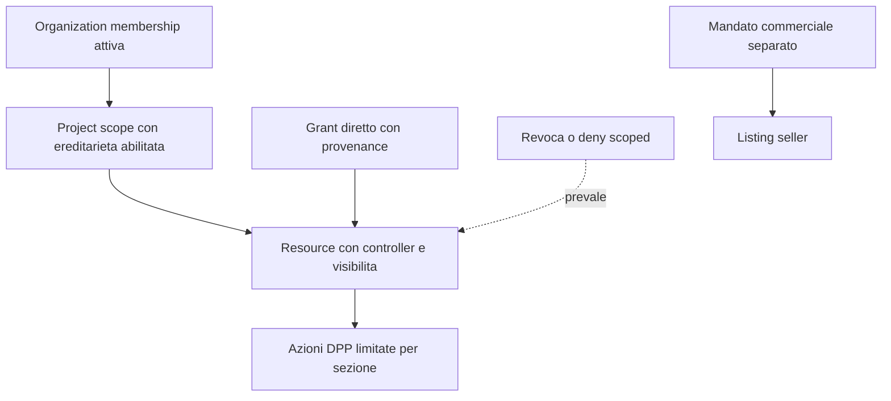

> **Edizione italiana.** [English version](../en/08-permission-model.md) · Le evidenze fissate a commit e i termini tecnici sono condivisi tra le due edizioni.

# 08 · Modello di permessi proposto

**Stato: proposta.** Entità e nomi seguenti non sono tabelle/API esistenti.

## Scelta: RBAC scoped + relazioni esplicite + attributi

- **RBAC:** ruoli comprensibili (org admin, project manager, editor, viewer, seller operator, repair operator) come insiemi versionati di azioni.
- **ReBAC limitata:** membership e grants su organization/project/resource; eredità controllata. Non convertire automaticamente ogni AgentRelationship in una delega.
- **ABAC:** stato account, invito accettato, scadenza, classificazione public/private, stato/versione DPP, sezione, contesto acting_for.
- **Capability:** utile per download temporanei e job limitati, non per trasformare ogni ID/URL in un bearer token permanente.

RBAC globale non distingue i progetti; ABAC pura rischia policy opache; ReBAC general-purpose è prematura senza regole di relazione. Il modello ibrido semplice copre la domanda attuale.

## Entità logiche nuove

| Entità proposta | Dati minimi | Autorità |
|---|---|---|
| Principal | ID Person o service, stato, chiavi attive/versioni | Zenflows identity module |
| OrganizationMembership | subject, org, ruoli, stato invited/active/revoked, validità | Zenflows permission module |
| ProjectScope | ID scope, org opzionale, risorse associate, inheritance flag | Zenflows |
| ResourceControl | resource ID, controller Person/org, visibilità, epoch, stato disputed | Zenflows |
| Grant | subject/group, scope, azioni o ruolo, issuer, expiry, provenance | Zenflows |
| Delegation | subject, acting_for, azioni, scope e scadenza | Zenflows |
| Invitation | destinatario verificato, scope, ruoli proposti, nonce hash, expiry | Zenflows |
| ExternalBinding | namespace servizio, ID esterno, resource ID, versione, stato | Zenflows per autorità; copia DPP controllata |
| AuditEvent | actor, service, acting_for, action, oggetto, esito, policy version, request ID | Audit append-only separato dai log request |

Niente ACL dentro `metadata`, `createdBy` o stringhe `EconomicOperator`: sono modificabili o non verificate oggi. [Evidenze del modello attuale](05-zenflows-analysis.md).

## Matrice proposta

✓ = consentito nello scope; G = solo grant dedicato; — = negato per default. I ruoli non sono globali. Un'azione deve rispettare anche stato account, scope, attributi e deny applicabili.

| Azione | Anonimo | Viewer | Editor | Project manager | Resource controller | Org admin | Seller operator | Repair operator |
|---|---|---|---|---|---|---|---|---|
| Leggere proiezione pubblica | ✓ | ✓ | ✓ | ✓ | ✓ | ✓ | ✓ | ✓ |
| Leggere contenuto privato | — | ✓ | ✓ | ✓ | ✓ | G | G | G |
| Creare risorsa personale | — | G | G | G | G | G | G | G |
| Creare per organizzazione | — | — | G | ✓ | G | ✓ | G | — |
| Edit contenuti risorsa | — | — | ✓ | ✓ | ✓ | G | G | — |
| Eliminare/archiviare risorsa | — | — | — | G | ✓ | G | — | — |
| Gestire grant sul progetto | — | — | — | ✓ | G | G | — | — |
| Delegare amministrazione risorsa | — | — | — | G | ✓ | G | — | — |
| Trasferire controller | — | — | — | — | G | G | — | — |
| Gestire membership org | — | — | — | — | — | ✓ | — | — |
| Eventi di inventario/trasferimento | — | — | G | G | G | G | G | — |
| DPP specifiche edit | — | — | G | G | G | G | — | — |
| DPP publish/withdraw | — | — | — | G | G | G | G | — |
| DPP repair append | — | — | — | — | G | G | — | ✓ |
| Listing commerciale edit/sell | — | — | — | — | G | G | ✓ | — |
| Stock commerciale | — | — | — | — | G | G | G | — |
| Ordini del seller assegnato | — | — | — | — | — | G | ✓ | — |
| Rimborso/payout | — | — | — | — | — | G | G | — |

Ogni persona attiva può ricevere il baseline platform `resource.create:self`; non deriva dal ruolo viewer. Platform operator gestisce cataloghi/configurazione e incident response, non ha automaticamente lettura commerciale universale. Accesso break-glass limitato nel tempo, motivato e auditato; separazione tra supporto e amministrazione economica.

## Ereditarietà e revoca

Proposta iniziale: eredità solo da **un** organization/project amministrativo, mai da citazioni, distinta base o contenimento ValueFlows. Risorsa personale citata da progetto aziendale non diventa aziendale. Child privato non diventa pubblico perché il parent è pubblico. Flag `inherit=false` richiede privilegio amministrativo, non normale editor.

Precedenza: account/servizio disabilitato o deny scoped → deny; membership revocata invalida grant derivati; grant diretto valido può sopravvivere soltanto se indipendente e approvato dal controller corrente. Per offboarding org, default sospendere anche deleghe emesse in quella capacità e verificare grant diretti agli ex membri. UI deve mostrare **tutte le fonti del diritto**: revocare un grant non annulla magicamente un altro.

Non ereditare automaticamente vendita, rimborsi, trasferimento controller, pubblicazione certificata o operazioni macchina. Deny inizialmente limitati a blocco account/scope e sospensione, evitando una DSL arbitraria difficile da spiegare.

## Ownership e delega

Il creator verificato ottiene controllo personale alla creazione solo nel caso self. Creazione per org richiede `resource.create` e delega verificata; il controller è org, non il dipendente. Il trasferimento controller è un comando a due fasi con consenso del destinatario, verifica privilegi, gestione grant esistenti e audit. Non inferirlo automaticamente da `transferAllRights`: proprietà economica, custodia e controllo amministrativo possono cambiare separatamente.

Nessuno può concedere diritti fuori dal proprio scope o oltre la propria capacità di delega. Un invite non attiva accesso prima dell'accettazione con identità verificata. Scadenze e revoche sono valutate server-side, non solo cancellando un pulsante.

## Public/private e query

Separare record interno e proiezione pubblica. Liste, conteggi, facet, traceDpp e relazioni annidate devono filtrare prima di serializzare; anche un count può divulgare presenza. `can(action, object)` per la GUI è un suggerimento con versione, non un token permanente. Usare errori coerenti per non enumerare oggetti privati.
