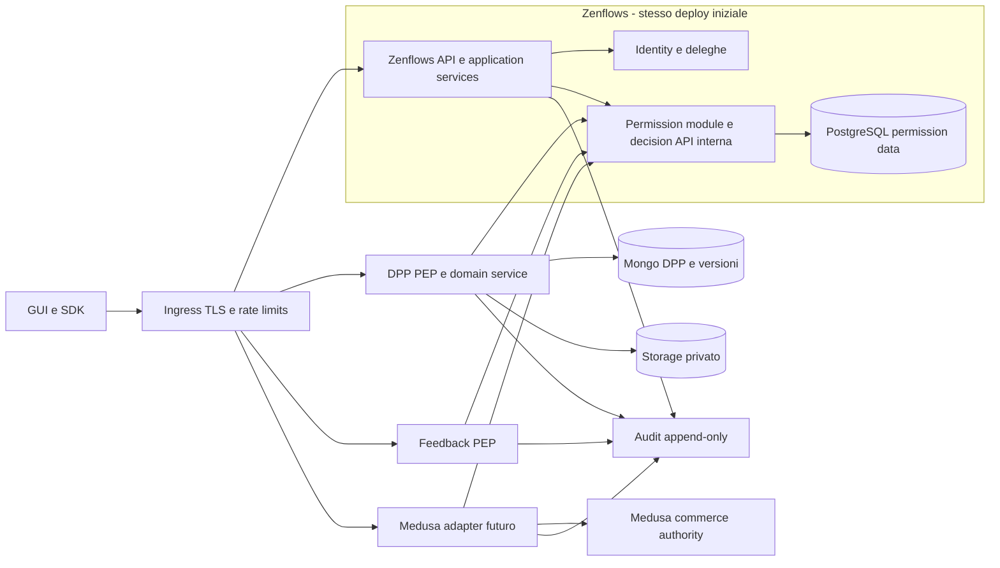
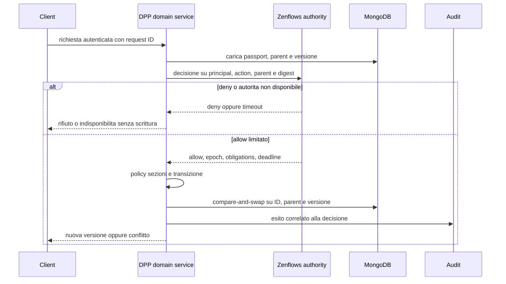

> **Edizione italiana.** [English version](../en/09-proposed-architecture.md) · Le evidenze fissate a commit e i termini tecnici sono condivisi tra le due edizioni.

# 09 · Architettura target proposta

## Componenti e autorità

Nuove strutture sono [proposte](08-permission-model.md). Zenflows resta autorità per principal, membership, resource control, deleghe, grants e binding esterni. DPP possiede contenuto, workflow e versioni del passport; Medusa possiederà ordini, prezzi, prenotazioni stock e pagamenti. Non replicare ownership come campi editabili indipendentemente.

## Identità e authentication boundary

In fase iniziale mantenere le firme Zenroom e username lookup, aggiungendo stato chiave/account e principal stabile. Le API DID devono risolvere una chiave a principal noto oppure a identità federata esplicitamente ammessa. Richieste sconosciute non diventano utenti solo perché un explorer restituisce 200. Non usare email/username modificabili come chiave ACL.

Per nuovi flussi: envelope versionato con `subject` verificabile, audience, metodo, route canonica, digest body, request ID, issued/expires. Protocolli di prova/delega devono essere definiti con vettori cross-language. Service identity distinta dall'attore umano: la firma utente autorizza la richiesta, la credenziale del servizio autentica il trasporto dell'asserzione. Un servizio non sceglie liberamente un subject.

## Decisione dentro Zenflows

1. Middleware autentica e produce ExecutionContext non costruibile dai parametri business.
2. Application service carica risorsa, stato/epoch, membership e oggetti coinvolti.
3. Policy deny-by-default: ruolo scoped, grants, acting_for, attributi e campi cambiati.
4. Controllo e update nella stessa transazione PostgreSQL, con locking/versione anche dei permessi rilevanti. Non basta avvolgere due letture stale in una transazione READ COMMITTED.
5. Validazioni ValueFlows, scrittura, audit/outbox nella stessa unità di commit.

I resolver mappano input e risposta. I job ricevono un service principal scoped; import non usa un booleano `skip_auth`. Primitive DB raw private e test/static checks ne impediscono l'uso nei normali entrypoint.

## Decisione DPP rappresentativa

Caricare il **parent già registrato**, non fidarsi di un `productId` nuovo per ottenere un allow. L'autorità valida binding esistente; creazione binding richiede diritto sul prodotto e idempotency key. Prima scrittura DPP e binding cross-DB non sono atomici: creare stato pending non pubblico, registrare binding con operazione idempotente, finalizzare, e riconciliare orfani. Nessun pending può essere pubblicato tramite route alternativa.

## TOCTOU: garanzie realistiche

Una decisione online e Mongo CAS proteggono cose diverse: la prima i diritti al momento della decisione, il secondo lo stato locale. **Non garantiscono da soli che una revoca intervenuta tra decisione e commit blocchi una scrittura già in volo.**

Proposta per rollout iniziale: nessuna cache positiva sulle scritture, deadline breve configurabile (target iniziale 5 secondi), CAS su versione e binding, nuova decisione a ogni retry. La revoca è efficace per nuove decisioni; l'interfaccia e l'audit distinguono revoca registrata da completamento delle operazioni già autorizzate. Pubblicazione, trasferimento controllo e operazioni monetarie richiedono la garanzia più forte prima dell'abilitazione.

Per queste azioni critiche proporre un protocollo di **write permit in-flight**: autorità registra op_id/epoch/deadline, revoca sospende nuovi permit e attende completamento o scadenza di quelli in corso; servizio vincola commit a permit, versione e deadline e non riusa un permit consumato. La revoca viene dichiarata completata solo dopo drain. Crash, clock skew, commit ambiguo e fencing vanno provati; non spacciare un JWT corto per transazione distribuita. Se il team richiede revoca strettamente linearizzabile senza finestra, spostare il comando critico nell'autorità con workflow serializzato o adottare coordinamento più forte: decisione Q11.

## Failure policy

| Guasto | Comportamento |
|---|---|
| Zenflows/authz timeout | Scritture e private read deny/503; nessun fallback permissivo |
| DB permessi down | Come sopra; non approvare con snapshot indefinito |
| DPP down dopo decisione | Retry con request ID; nuova decisione se deadline scaduta; riconciliazione |
| Audit sink down | Outbox durevole locale; operazioni critiche non procedono se non si può registrare l'intenzione/esito durevole |
| Event bus invalida-cache down | Write online comunque aggiornata; cache read con TTL e classificazione |
| Medusa down | Collaborazione resta disponibile; nessun ordine inventato nel browser |
| DID resolver down | Percorso legacy fallisce chiuso; eventuale cache di chiavi già risolte con revoca definita, mai `allow` su errore |

## Amministrazione e service identity

Registrazione pubblica mediata da un endpoint ristretto server-side, distinto dalle operazioni admin di delete/import. Rimuovere il bisogno di una credenziale admin browser senza interrompere signup: deploy BFF/registration command, aggiornamento GUI, poi rotazione coordinata di tutti i consumer. Aggiungere controllo self, rate limit, proof-of-key e email verification secondo policy.

Usare identità per servizio e ambiente; TLS, token brevi audience-scoped o mTLS secondo infrastruttura disponibile. Non introdurre un PKI interno complesso solo per principio: inizialmente credenziali distinte e rotabili su TLS possono essere un compromesso documentato. Nessun account worker può concedere `platform.admin`; i privilegi si sommano solo tramite delega validata, non header forwarded.

## Audit e privacy

Registrare decision ID, request ID, actor, service, acting_for, azione, oggetti coinvolti, versioni prima/dopo, allow/deny e reason, policy/epoch, timestamp e origine del grant. Non loggare chiavi, seed, firme riutilizzabili o interi body privati. Eventi economici non sono audit di sicurezza: provider può non coincidere con attore e mancano i tentativi negati. Append-only con retention/accesso dedicati, correlazione tra servizi e allarmi per grant/revoca/ownership/publication.

## Misure di successo

Copertura PEP del 100% delle operazioni inventariate abilitate; nessun consumer legacy fuori inventario; test matrix positivi/negativi; SLO da misurare per decision latency e revoca; contatori deny/timeout/conflitto distinti. Solo dopo misurazioni valutare estrazione authz o caching positivo.
