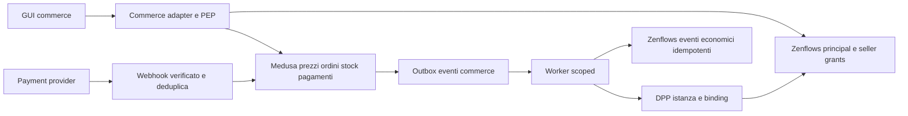

> **Edizione italiana.** [English version](../en/10-medusa-implications.md) · Le evidenze fissate a commit e i termini tecnici sono condivisi tra le due edizioni.

# 10 · Implicazioni per MedusaJS

## Cosa esiste: una preview, non un marketplace

`lib/previewCommerce/mockData.ts` contiene un prodotto dimostrativo, un seller testuale, varianti assembled/kit/bom, prezzi, righe stock, ordini e indirizzo mock. `cart.tsx` mantiene stato React e persiste variante/quantità in sessionStorage. Il checkout usa un timeout e naviga alla pagina ordine; non crea ordini né riserva stock. Il GSSP ritorna `publicPage: true` quando la feature flag è attiva. Non c'è isolamento tenant da valutare come implementazione commerce attuale.

[interfacer-gui/lib/previewCommerce/mockData.ts:17–183](https://github.com/interfacerproject/interfacer-gui/blob/9afe601d4d28dd6ccc0b4db2092da65f8055823e/lib/previewCommerce/mockData.ts#L17-L183); [interfacer-gui/lib/previewCommerce/cart.tsx:23–110](https://github.com/interfacerproject/interfacer-gui/blob/9afe601d4d28dd6ccc0b4db2092da65f8055823e/lib/previewCommerce/cart.tsx#L23-L110); [interfacer-gui/pages/preview/commerce/checkout.tsx:64–80](https://github.com/interfacerproject/interfacer-gui/blob/9afe601d4d28dd6ccc0b4db2092da65f8055823e/pages/preview/commerce/checkout.tsx#L64-L80); [interfacer-gui/lib/previewCommerce/gssp.ts:26–36](https://github.com/interfacerproject/interfacer-gui/blob/9afe601d4d28dd6ccc0b4db2092da65f8055823e/lib/previewCommerce/gssp.ts#L26-L36).

Le pagine sales/inventory/orders/sell consumano dati statici; `components/previewCommerce` presenta buy block, prezzi, onboarding e riepilogo. Il toggle di emissione automatica passport è una proposta UX a fulfillment, non un job DPP implementato. [interfacer-gui/lib/previewCommerce/mockData.ts:207–365](https://github.com/interfacerproject/interfacer-gui/blob/9afe601d4d28dd6ccc0b4db2092da65f8055823e/lib/previewCommerce/mockData.ts#L207-L365).

## Assunzioni da non trasferire al backend

| Preview | Prerequisito reale |
|---|---|
| Seller come stringa unica | Seller ID stabile, soggetto legale, organization/person verificati e mandato |
| Totali calcolati nel browser | Prezzi/tasse/sconti/spedizione ricalcolati server-side |
| Stock e reserved statici | Authority unica di stock commerciale, prenotazioni atomiche/idempotenti |
| Un carrello e un seller | Decidere single-seller al primo rilascio o split order multi-seller |
| Pagina ordine raggiunta da timeout | Stato ordine da backend; nessuna fiducia in redirect pagamento |
| Profilo/indirizzo mock | Customer identity e consenso; minimizzazione PII per seller |
| DPP label su righe ordine | Binding ordine-linea-unità-passport e stato emissione riconciliabile |
| Pubblicazione prodotto dalla UI | `listing.publish` con mandato, compliance e disponibilità |

Non si assume una versione Medusa o supporto multi-vendor nativo: queste scelte richiedono uno spike mirato e verifica delle API della release selezionata.

## Separazione dei diritti

`resource.update` **non implica** `listing.sell`. Un collaboratore può migliorare il design senza rappresentare il produttore, possedere la merce o ricevere pagamenti. Licenza open hardware permette usi secondo condizioni legali, non assegna automaticamente privilegi sul seller account di altri.

Seller propone una propria offerta collegata a un design pubblico senza ottenere controllo su quel design. Il controller di un design non deve necessariamente approvare ogni seller indipendente: distinguere policy della piattaforma e diritto di licenza. Se si usa il DPP del produttore originale, l'associazione e l'attestazione del produttore richiedono regole esplicite.

| Azione commerce proposta | Autorizzazione |
|---|---|
| Creare listing | Seller attivo, mandato nello scope seller, riferimento risorsa leggibile e licenza/compliance |
| Modificare prezzi o disponibilità | Product manager seller; mai client-supplied seller ID senza verifica |
| Gestire inventario | Inventory role su location del seller; autorizzazione su ogni stock item |
| Vedere ordine | Customer proprietario; seller solo suborder proprio; supporto con motivazione |
| Fulfillment | Seller operator autorizzato, stato ordine appropriato |
| Rimborso | Finance role, limiti importo/stato, eventuale doppia approvazione |
| Modificare payout account | Seller legal admin, step-up auth; audit e notifica out-of-band |
| Emettere DPP istanza | Worker scoped su fulfillment verificato, non generico admin |

Offboarding: rimuovere membership revoca seller access/sessioni/deleghe, ma non cambia seller legale di ordini storici né l'accesso legittimo del customer. Trasferimento seller e payout non sono normali edit di Organization.

## Architettura d'integrazione proposta

Customer ID Medusa ↔ principal Interfacer tramite mapping univoco e login federato/challenge sicuro; non per email dichiarata. Seller ID ↔ soggetto legale organizzazione/persona + memberships amministrate. Store/customer API distinte dalle API seller/admin; non esporre credenziali Medusa admin nel frontend.

Medusa autorevole per ordini, prezzi e stock **commerciale**. Zenflows autorevole per eventi/traceability ValueFlows. Decidere se onhand ValueFlows è proiezione del ledger commerce o sistema primario per specifici stock: evitare due master che aggiornano la stessa quantità senza riconciliazione. Eventi con origin ID, mapping versionato e deduplica, retry e dead-letter; niente doppio decremento per replay.

DPP dopo purchase non necessariamente significa «al pagamento»: la preview suggerisce fulfillment. Per istanze fisiche emettere dopo assegnazione seriale/fulfillment, con idempotency key ordine-linea-unità. Resi/rimborsi non cancellano la storia; aggiungono stato/eventi senza esporre dati del cliente nel passport pubblico.

## Webhook e pagamenti

Rischi **futuri**, non vulnerabilità Medusa confermate: firma webhook su raw body, timestamp/nonce e replay cache, source verification, amount/currency/order reconciliation; transazione con outbox e idempotency key. PSP è autorità sull'esito finanziario, non la pagina success del browser. Nessuna carta nei servizi DPP/Zenflows o nei log; usare integrazione hosted/tokenizzata appropriata.

## Gate prima dell'integrazione

Principal stabile e binding chiavi, membership/offboarding, seller scope e legal owner, resource/DPP permissions, auditing e idempotenza, API test multi-seller e policy indisponibilità devono esistere prima di attivare acquisti reali. [Roadmap fasi 6–7](12-migration-roadmap.md).
